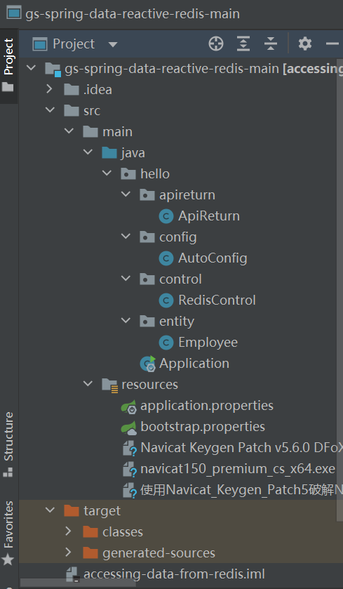
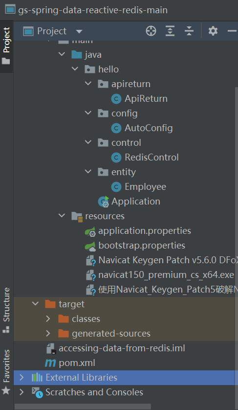

# Accessing Data Reactively with Redis

[TOC]

这个和mysql有点像。

官网地址：https://spring.io/guides/gs/spring-data-reactive-redis/

## 制作目标

在redis上以list,string,hash和set进行实体的增删改查和set的交并差操作。


## 基础知识

redis是个外网的程序，通过底层通道与我的程序连接。这让我的程序能操作redis数据。

redisTemplate针对许多数据类型提供许多封装好的数据处理方法，非常有用。

redis针对的数据类型：

string,hash,list,set,zset。

我这里就实现一下用户类的增删改查。


### 基本概念

#### redis数据结构

**key-value**

在许多redis操作中它会提示你这个参数是key，那个参数是value

这里的key通常指的是数据名。比如set的名字，hash的名字，而不是hash中键值对的键。

这里的value是数据名下的值。比如hash中所提及的键值对这一整体。

这一点我饶了一忽儿，后来搞明白了。如果你看不懂，后面在“我的代码”中会再次提及。


#### setOperations

- 这是redis提供的数据处理的方法
- 能处理的数据类型有**string，set，hash，list和zset**
- 它封装了许多实用的操作，这也是redis鹤立鸡群之处。本篇实现实体的增删改查和交并差。


#### 序列化与反序列化

- 序列化：把对象转化为可传输的字节序列过程称为序列化。
- 反序列化：把字节序列还原为对象的过程称为反序列化。


------


#### 为什么需要序列化

- 序列化最终的目的是为了对象可以跨平台存储，和进行网络传输。而我们进行跨平台存储和网络传输的方式就是IO，而我们的IO支持的数据格式就是字节数组。
- 因为我们单方面的只把对象转成字节数组还不行，因为没有规则的字节数组我们是没办法把对象的本来面目还原回来的，所以我们必须在把对象转成字节数组的时候就制定一种规则（序列化），那么我们从IO流里面读出数据的时候再以这种规则把对象还原回来（反序列化）。
- 如果我们要把一栋房子从一个地方运输到另一个地方去，序列化就是我把房子拆成一个个的砖块放到车子里，然后留下一张房子原来结构的图纸，反序列化就是我们把房子运输到了目的地以后，根据图纸把一块块砖头还原成房子原来面目的过程


作者：滴流乱转的小胖子
链接：https://www.jianshu.com/p/cc5a29b06b3d
来源：简书
著作权归作者所有。商业转载请联系作者获得授权，非商业转载请注明出处。


------

**以下直至长横线部分转自“简书”中另外某篇博文，文章出处我已经找不到了。我手敲了这篇博文以加深记忆，并且在原稿旁边加了一些我的理解。如果原作者找到我，我很乐意加上您原稿的链接。**

------


#### springboot访问redis时要序列化操作


springboot与Redis的交互是以二进制方式进行（`byte[]`）。为了支持Java中的数据类型，就要对操作的对象（key，value，hashKey，hashValue...）做序列化操作。

**redisTemplate 只为 key value hashKey hashValue 设置serializer**

默认的方案是使用了 `JdkSerializationRedisSerializer`，所以导致了前面的结果，注意：字符串和使用 jdk 序列化之后的字符串是两个概念。

````
在 RedisTemplate.afterPropertiesSet() 方法中，可以看到，默认的序列化方案:
````

```java
public void afterPropertiesSet() {
     super.afterPropertiesSet();
     boolean defaultUsed = false;
     if (defaultSerializer == null) {
        defaultSerializer = new JdkSerializationRedisSerializer(
              classLoader != null ? classLoader : this.getClass().getClassLoader());
     }
     if (enableDefaultSerializer) {
        if (keySerializer == null) {
           keySerializer = defaultSerializer;
           defaultUsed = true;
        }
        if (valueSerializer == null) {
           valueSerializer = defaultSerializer;
           defaultUsed = true;
        }
        if (hashKeySerializer == null) {
           hashKeySerializer = defaultSerializer;
           defaultUsed = true;
        }
        if (hashValueSerializer == null) {
           hashValueSerializer = defaultSerializer;
           defaultUsed = true;
        }
    }
	...
    initialized = true;
}
```


这时候如果存入键值对，value为string时，用可视化工具可以看到存入redis中的value前面会有些奇奇怪怪的数字啥的。这是因为默认使用的序列化方法。

set源码：

```java
public void set(K key, V value) {
   final byte[] rawValue = rawValue(value);
   execute(new ValueDeserializingRedisCallback(key) {

      protected byte[] inRedis(byte[] rawKey, RedisConnection connection) {
         connection.set(rawKey, rawValue);
         return null;
      }
   }, true);
}
```

可以看出，最终与 Redis 交互使用的是原生的 connection，键值则全部是字节数组，意味着所有的序列化都依赖于应用层完成，Redis 只认字节！也就是说我们要对给redis的字节序列化。

**序列化是与 Redis 打交道很关键的一个环节。**

比如，如果我们用StringRedisTemplate类中的StringRedisSerializer来对我们给redis的数据序列化，string类型的数据前面就不会有奇奇怪怪的数字了，可读性大大提高。

就像这样：

```java
public class StringRedisTemplate extends RedisTemplate<String, String>{
    public StringRedisTemplate() {
        RedisSerializer<String> stringSerializer = new StringRedisSerializer();
        setKeySerializer(stringSerializer);
        setValueSerializer(stringSerializer);
        setHashKeySerializer(stringSerializer);
        setHashValueSerializer(stringSerializer);
    }
  	...
}
```

即只能存字符串：

```java
@Autowired
StringRedisTemplate stringRedisTemplate;

stringRedisTemplate.opsForValue().set("student:2", "SkYe");
```


#### 项目中序列化要点

理论上，字符串（本质是字节）其实是万能格式。也就是说，可以使用StringRedisTemplate将复杂的对象存入redis。我们可以手动在自己的程序（应用层）将对象序列化为字符串，如使用Fastjson，jackson等工具，反序列化是也是通过字符串还原出原来的对象。**（我试过，很不好用，还是交给序列化器方便省事）**

而如果使用 ``redisTemplate.opsForValue().set("student:3",new Student(3,"kirito"));``便是依赖于内部的序列化器将new的Student对象转成String。这和使用 ``stringRedisTemplate.opsForValue().set("student:3",JSON.toJSONString(new Student(3,"kirito")));是等价操作。``

因为JSON.toJSONString是将对象转成json字符串。（试一试，感受一下，为什么前面是用redisTemplate，而后面用StringRedisTemplate呢？？？）


**但是有两点要注意**：****

- redis只认字节。
- 使用什么样的序列化器序列化，就要使用什么样的饭序列化器反序列化。


### 序列化接口redisSerializer

无论是redisTemplate默认使用的JdkSerializationRedisSerializer，还是stringRedisTemplate中使用的StringRedisSerializer，都是实现了同一的接口RedisSerializer。


```java
public interface RedisSerializer<T> {
   byte[] serialize(T t) throws SerializationException;
   T deserialize(byte[] bytes) throws SerializationException;
}
```

在spring-data-redis中提供了其他默认实现，用于替换默认的序列化方案。

GenericToStringSerializer一类与内部的ConversionService，将所有的类型转存为字符串。

GenericJackson2JsonRedisSerializer 和 Jackson2JsonRedisSerializer都能将java对象转化成json字符串。

我准备使用后者。

OxmSerializer以XML的形式序列化对象。


#### 我们可能出于什么样的目的修改序列化器呢？

- 各个工程质检约定了数据格式，如使用了JSON等通用数据格式，可以让异构的系统接入redis同样能识别数据，而默认方法不行。
- 数据的可视化，在运维是可以清晰的查看各个value值，非常方便。
- 效率问题，如果需要将大的对象存入redis，或者redis io非常频繁，替换合适的序列化器可以优化。


------

### **替换默认序列化器**

可以将全局的redisTemplate覆盖，也可以在使用时局部实例化一个redisTemplate替换（不依赖于ioc容器），需要根据实际情况选择替换方式。

我在用


```java
@Configuration
public class AutoConfig {
    @Bean
    public RedisTemplate<String, String> redisTemplate(RedisConnectionFactory redisConnectionFactory) {
        RedisTemplate<String, String> redisTemplate = new RedisTemplate<>();
        redisTemplate.setConnectionFactory(redisConnectionFactory);
        
        Jackson2JsonRedisSerializer jackson2JsonRedisSerializer = new Jackson2JsonRedisSerializer(Employee.class);

        ObjectMapper om = new ObjectMapper();
		om.setVisibility(PropertyAccessor.ALL, JsonAutoDetect.Visibility.ANY);
 		om.activateDefaultTyping(LaissezFaireSubTypeValidator.instance ,
        ObjectMapper.DefaultTyping.NON_FINAL);
        
        redisTemplate.setKeySerializer(new StringRedisSerializer());
    	redisTemplate.setValueSerializer(jackson2JsonRedisSerializer); 
        redisTemplate.setHashKeySerializer(new StringRedisSerializer());
		redisTemplate.setHashValueSerializer(new jackson2JsonRedisSerializer);
        redisTemplate.afterPropertiesSet();
        return redisTemplate;
    }
}
```

**代码解析**：

- **@Configuration**

告诉springboot，这是个配置


- **@Bean**

@Bean明确地指示了一种产生一个bean（对象的实例）的方法，并且交给Spring容器管理


- **redisTemplate.setConnectionFactory**(**redisConnectionFactory**);

这是给redis的连接工厂，意味着我用redisTemplate能和redis交流。


- **Jackson2JsonRedisSerializer jackson2JsonRedisSerializer = new Jackson2JsonRedisSerializer(Employee.class);**

Jackson2JsonRedisSerializer是一个把指定java对象转化成JSON字符串的序列化器。我这里要转化的是Employee类的对象，所以括号里是Employee.class。


- **ObjectMapper om = new ObjectMapper();**

[ObjectMapper](https://github.com/Hearst-DD/ObjectMapper) 是一个使用 Swift 编写的用于 model 对象（类和结构体）和 JSON 之间转换的框架。

关于om，我的项目中没有用到。如果要用，好像因为版本问题这种方法不行，较新资讯：

https://blog.csdn.net/lyayfy/article/details/107333898?ops_request_misc=%257B%2522request%255Fid%2522%253A%2522162757540916780261910017%2522%252C%2522scm%2522%253A%252220140713.130102334..%2522%257D&request_id=162757540916780261910017&biz_id=0&utm_medium=distribute.pc_search_result.none-task-blog-2~all~sobaiduend~default-2-107333898.first_rank_v2_pc_rank_v29&utm_term=+objectMapper.setVisibility&spm=1018.2226.3001.4187


- **redisTemplate.setKeySerializer(new StringRedisSerializer());**
      	**redisTemplate.setValueSerializer(jackson2JsonRedisSerializer);** 
          **redisTemplate.setHashKeySerializer(new StringRedisSerializer());**
        		**redisTemplate.setHashValueSerializer(new jackson2JsonRedisSerializer);**

  手动指定RedisTemplate的Key，Value，HashKey和HashValue的序列化器

（1）key和HashKey序列化器我都设置成StringRedisSerializer，这样redis可视化时不用生成乱码了

（2）另外两者我都设置成Jackson2JsonRedisSerializer，这样redis终于能读我的数据了

然后使用RedisTemplate进行保存


### 小试牛刀：


```java
@Autowired
RedisTemplate RedisTemplate;

public void test() {
    Student student3 = new Student();
    student3.setName("kirito");
    student3.setId("3");
    student3.setHobbies(Arrays.asList("coding","write blog","eat chicken"));
    redisTemplate.opsForValue().set("student:3",student3);
}
```

去可视化工具中查看结果：是标准的JSON格式。


### 拓展知识


曾经俩同事操作redis，一个使用了redisTemplate，一个使用了stringRedisTemplate，当他们操作同一个键值对时，key虽然相同，但由于序列化器的不同，导致无法获取成功。

还有一点就是，同事之间的微服务不同模块连接同一个redis，在共享内存中国交互数据，可能由于版本差异，模块差异，导致序列化方案不一致，也会引起问题。


------

**以上直至长横线部分转自“简书”中某篇博文，文章出处我已经找不到了。我手敲了这篇博文以加深记忆，并且在原稿旁边加了一些我的理解。如果原作者找到我，我很乐意加上您原稿的链接。**

------


## 上手代码

**在redis上进行增删改查和交并差操作**

理解了对于redis来说重要的序列化器问题，经过了小试牛刀。我们终于可以用redis底层提供的setOperations来对redis中的string，set，hash，list和zset进行一些redis封装好的操作了。

**这是真正激动人心的时刻！！！**

因为redis最好用的地方在于它**封装了各式各样好用的操作**。

**我作为一个新手，做了在redis上以list,string,hash和set对Employee对象进行增删改查和交并差操作。**


### 文件结构







我们先看一下需要的配置文件

pom.xml不用说了，spring的神，能下好多网上有的依赖包，减轻我们写代码的负担。


### pom.xml

```java
<?xml version="1.0" encoding="UTF-8"?>
<project xmlns="http://maven.apache.org/POM/4.0.0" xmlns:xsi="http://www.w3.org/2001/XMLSchema-instance"
         xsi:schemaLocation="http://maven.apache.org/POM/4.0.0 https://maven.apache.org/xsd/maven-4.0.0.xsd">
    <modelVersion>4.0.0</modelVersion>
    <parent>
        <groupId>org.springframework.boot</groupId>
        <artifactId>spring-boot-starter-parent</artifactId>
        <version>2.5.2</version>
        <relativePath/> <!-- lookup parent from repository -->
    </parent>
    <groupId>com.example</groupId>
    <artifactId>accessing-data-from-redis</artifactId>
    <version>0.0.1-SNAPSHOT</version>
    <name>accessing-data-from-redis</name>
    <description>Demo project for Spring Boot</description>
    <properties>
        <java.version>1.8</java.version>
    </properties>
    <mirrors>
        <mirror>
            <id>mirrorId</id>
            <mirrorOf>central</mirrorOf>
            <name>Human Readable Name for this Mirror.</name>
            <url>http://central.maven.org/maven2/</url>
        </mirror>
    </mirrors>
            <dependency>
                <groupId>org.springframework.boot</groupId>
                <artifactId>spring-boot-starter-data-redis</artifactId>
            </dependency>
            <dependency>
                <groupId>org.projectlombok</groupId>
                <artifactId>lombok</artifactId>
                <!--   <version>1.18.20</version>-->
                <optional>true</optional>
            </dependency>
            <dependency>
                <groupId>org.springframework.boot</groupId>
                <artifactId>spring-boot-starter-web</artifactId>
            </dependency>
            <dependency>
                <groupId>org.springframework.boot</groupId>
                <artifactId>spring-boot-starter-redis</artifactId>
                <version>1.3.8.RELEASE</version>
            </dependency>
            <dependency>
                <groupId>org.springframework.boot</groupId>
                <artifactId>spring-boot-starter-data-redis</artifactId>
            </dependency>
            <dependency>
                <groupId>com.alibaba</groupId>
                <artifactId>fastjson</artifactId>
                <version>1.2.3</version>
            </dependency>


    <build>
        <plugins>
            <plugin>
                <groupId>org.springframework.boot</groupId>
                <artifactId>spring-boot-maven-plugin</artifactId>
            </plugin>
        </plugins>
    </build>

</project>
```

有关于pom.xml的基本知识：

https://www.jianshu.com/p/f99de36fb0f4

这里对我的项目来说不是重点，我就不手敲了。


application.properties

```java
#server.port=8004

# Redis?????????0?redis???16?? ????0??
spring.redis.database=8
# Redis????? ???ip
spring.redis.host=192.168.4.31
# Redis???????
spring.redis.port=6379
# Redis?????????????
spring.redis.password=root@hiekn
# ??????????????????? ???mysql????
spring.redis.jedis.pool.max-active=200
# ??????????????????????? ??????????? ????????????
spring.redis.jedis.pool.max-wait=-1
# ???????????
spring.redis.jedis.pool.max-idle=10
# ???????????
spring.redis.jedis.pool.min-idle=0
# ?????????? ???redis???
spring.redis.timeout=6000
```


bootstrap.properties

```java
# Redis?????????0?redis???16?? ????0??
spring.redis.database=8
# Redis????? ???ip
spring.redis.host=192.168.4.31
# Redis???????
spring.redis.port=6379
# Redis?????????????
spring.redis.password=root@hiekn
# ??????????????????? ???mysql????
spring.redis.jedis.pool.max-active=200
# ??????????????????????? ??????????? ????????????
spring.redis.jedis.pool.max-wait=-1
# ???????????
spring.redis.jedis.pool.max-idle=10
# ???????????
spring.redis.jedis.pool.min-idle=0
# ?????????? ???redis???
spring.redis.timeout=6000
```


### 再看一下我的实体

```java
package hello.entity;


import java.io.Serializable;

//@Bean
public class Employee implements Serializable {
    String id;
    String email;
    String name;

    public String getid() {
        return id;
    }

    public void Setid(String id) {
        this.id = id;
    }

    public String getEmail() {
        return email;
    }

    public void SetEmail(String email) {
        this.email = email;
    }

    public String getName() {
        return name;
    }

    public void SetName(String name) {
        this.name = name;
    }

    @Override
    public String toString() {
        return "Employee{" +
                "id='" + id + '\'' +
                ", email='" + email + '\'' +
                ", name='" + name + '\'' +
                '}';
    }
}
```

这里的实体就是我要处理的用户

**注意要重写toString方法**，否则从redis下载用户信息时，就算序列化没问题，显示的也只能是实体的地址。

而且这个地址还老是在变动，就好像在调戏你。


我的序列化器在前边“替换序列化器”那里详细介绍了。这也和mysql很大的不同。


### 我的服务层

这里的服务我都没用到，具体对数据的操作都在控制层完成了。大家别学我，规范还是很重要的，我这里是因为需要实现的目标很少，项目不复杂，所以才偷懒。


### 我的控制层

````
//基本框架
````

```java
@RestController
@RequestMapping("/redis")
public class RedisControl {

    @Autowired
    private RedisTemplate<String,String> redisTemplate;
    
}
```

`@RestController`注解将 return 中的内容以 JSON字符串的形式返回客户端

`@RequestMapping`注解是让调用时在“/redis"中调用

`@Autowired`注解是让spring在项目中找前面替换序列化器中  `@Configuration` 下的 `@Bean`

RedisTemplate：

Helper class that simplifies Redis data access code.

Performs automatic serialization/deserialization between the given objects and the underlying binary data in the Redis store. By default, it uses Java serialization for its objects (through JdkSerializationRedisSerializer ). For String intensive operations consider the dedicated StringRedisTemplate.

The central method is execute, supporting Redis access code implementing the RedisCallback interface. It provides RedisConnection handling such that neither the RedisCallback implementation nor the calling code needs to explicitly care about retrieving/closing Redis connections, or handling Connection lifecycle exceptions. For typical single step actions, there are various convenience methods.

Once configured, this class is thread-safe.

Note that while the template is generified, it is up to the serializers/deserializers to properly convert the given Objects to and from binary data.


#### set

不重复的无序集

````
//设置redis中的key和value
````

```java
@RequestMapping("/add")
public String SetRedis(@RequestParam String company, @RequestBody Employee employee){
    Employee employee1 = new Employee();
    employee1.Setid(employee.getid());
    employee1.SetName(employee.getName());
    employee1.SetEmail(employee.getEmail());
    redisTemplate.opsForSet().add(company,employee1.getid(),employee1.getName(),employee1.getEmail());
    return "add";
}
```


加在redis上的结果可以在“Another Redis Desktop Manager"上查看

可视化中：


````
//获得redis中的value
````

```java
	@RequestMapping("/showall")
    public String getRedis(@RequestParam String company){
        if(!redisTemplate.opsForSet().members(company).isEmpty())
            return "redis获得值成功"+redisTemplate.opsForSet().members(company);
        else
            return "redis获取值失败";
    }
```


````
//查id是否存在
````

```java 
@RequestMapping("/checkById")
public String CheckRedis(@RequestParam String company,@RequestParam String id){
    if(Objects.requireNonNull(redisTemplate.opsForSet().members(company)).contains(id))
        return "yes";
    else
        return "no";
}
```


````
//修改redis中的value
````

```java
@RequestMapping("/update")
public String updateRedis(@RequestParam String company,@RequestParam String id,@RequestParam String name,@RequestParam String email){
    redisTemplate.opsForSet().add(company,id,name,email);
    return "Updated";
}
```


````
//删除redis中的value
````

```java
@RequestMapping("/delete")
public String deleteRedis(@RequestParam String company,@RequestParam String id,@RequestParam String name,@RequestParam String email){
	if(Objects.requireNonNull(redisTemplate.opsForSet().members(company)).contains(id))		{
        	redisTemplate.opsForSet().remove(company,id,name,email);
            return "deleted";
     }
     else
       		return "Your id to delete is empty!";
}
```


````
//取交集
````

```java
@RequestMapping("/intersect")
public String intersectRedis(@RequestParam String company1,@RequestParam String company2){
    return "intersect : "+redisTemplate.opsForSet().intersect(company1,company2);//这里的key是集合的名字
}
```


````
//取并集
````

```java
@RequestMapping("/union")
public String unionRedis(@RequestParam String company1,@RequestParam String company2){
    return "union : "+redisTemplate.opsForSet().union(company1,company2);//这里的key是集合的名字
}
```


````
//取差集
//difference(company1,company2)中是company1-company2，也就是说company1和2不同处，留company1的
````

```java
@RequestMapping("/difference")
public String differenceRedis(@RequestParam String company1,@RequestParam String company2){
    return "difference : "+redisTemplate.opsForSet().difference(company1,company2);//这里的key是集合的名字
}
```


#### hash

键值对


````
加
````

```java
@RequestMapping("/add")
public String SetRedis(@RequestParam String company, @RequestBody Employee employee){
    Employee employee1 = new Employee();
    employee1.Setid(employee.getid());
    employee1.SetName(employee.getName());
    employee1.SetEmail(employee.getEmail());
    redisTemplate.opsForSet().add(company,employee1.getid(),employee1.getName(),employee1.getEmail());
    return "add";
}
```


````
//获得redis中的id对应的value
````

```java
@RequestMapping("/select")
    public String getRedis(@RequestParam String company,@RequestParam String id){
        return "redis获得值成功"+"name="+redisTemplate.opsForHash().get(company, id);
    }
```


```
//获得redis中所有的value
```

````java
@RequestMapping("/select")
    public String getRedis(@RequestParam String company){
        return "redis获得值成功"+"name="+redisTemplate.opsForHash().entries(company);
    }
````


````
//修改redis中的value
````

```java
@RequestMapping("/update")
    public String updateRedis(@RequestParam String company,@RequestParam String id,@RequestParam String name,@RequestParam String email){
        HashMap<String, List> hashMap = new HashMap<>();
        ArrayList list = new ArrayList() ;
        list.add(name);
        list.add(email);
        hashMap.put(id,list);//id为key;list为value（这是对于hash数据结构来说的）
        if(redisTemplate.boundHashOps(company).lengthOfValue(id) != 0){
            redisTemplate.boundHashOps(company).putAll(hashMap);//company是key，hashMap是value(这是针对redis数据结构说的)
            return "Updated";
        }
        else
            return "Your id to update is wrong!";
    }
```


````
 //删除redis中的id对应的value
````

```java
@RequestMapping("/delete")
    public String deleteRedis(@RequestParam String company,@RequestParam String id){
        if(redisTemplate.boundHashOps(company).hasKey(id)){
            redisTemplate.boundHashOps(company).delete(id);
            return "deleted";
        }
        return "Your id to delete is wrong!";
    }
```


#### list

一开始做的时候天天给我报这个错：

WRONGTYPE Operation against a key holding the wrong kind of value

快给我整吐了。后来改了序列化器就好了。所以说，我到这种自己不知道的bug，先去干干别的事情，了解一下自己不知道的知识，喝杯水调整一下心情，说不定回来就好了。

````
//设置redis中的key和value
````

```java
@RequestMapping("/add")
public String HashRedis(@RequestParam String company, @RequestBody Employee employee){
    redisTemplate.opsForList().leftPush(company,employee);
    return "add";
}
```


````
//根据index索引获得redis中的value
````

```java
@RequestMapping("/select")
public String getRedis(@RequestParam long index,@RequestParam String company){
    if(redisTemplate.opsForList().size(company)!=0)
        return "redis获得值成功"+redisTemplate.opsForList().index(company,index);
    else
        return "redis获得值失败";
}
```


````
//修改redis中的index对应的的value
````

```java
@RequestMapping("/update")
public String updateRedis(@RequestParam String company,@RequestParam long index,@RequestBody Employee employee){
    if(redisTemplate.boundListOps(company).index(index)!=null)
        redisTemplate.opsForList().set(company, index, employee);
        return "updated";
    else
        return "Your index is wrong!";
}
```


````
//获得redis中所有对应list（company）的值
````

```java
@RequestMapping("/showall")
public String getRedis(@RequestParam String company){
    if(redisTemplate.opsForList().size(company)!=0)
        return "redis获得值成功"+redisTemplate.opsForList().range(company,0,-1);
    else
        return "redis获得值失败";
}
```


````
//移除num个值为employee(value),返回移除个数
````

```java
@RequestMapping("/delete")
public String getRedis(@RequestParam String company,@RequestParam long num,@RequestBody Employee employee){
    if(redisTemplate.opsForList().size(company)!=0)
        return "deleted ："+redisTemplate.opsForList().remove(company,num,employee);
    else
        return "error";
}
```


#### String

这里的序列化器用jdk或者string都行

````
//设置redis中的key和value
````

```java
@RequestMapping("/add")
    public String SetRedis(@RequestParam String company, @RequestParam String name){
        redisTemplate.opsForValue().set(company,name);
        return "add";
    }
```


````
//获得redis中的value
````

```java
@RequestMapping("/showall")
    public String getRedis(@RequestParam String company)
            return "redis获得值成功"+redisTemplate.opsForValue().get(company);
}
```


````
//修改redis中的value
````

```java
@RequestMapping("/update")
    public String updateRedis(@RequestParam String company,@RequestParam String name){
			redisTemplate.opsForValue().set(company,name);
            return "Updated";
    }
```


````
 //删除redis中的value
````

```java
@RequestMapping("/delete")
    public String deleteRedis(@RequestParam String company){

        redisTemplate.delete(company);
        return "deleted";

    }
```


#### 注意

如果我用string操作某个redis数据，是不能用其他数据类型的方法操作它的。


## 别人的代码

https://www.cnblogs.com/zeng1994/p/03303c805731afc9aa9c60dbbd32a323.html


## 我在这过程中学到的其他知识

- jedis是一种连接池
  与redis数据交互使网络断开重连很耗费时间精力，所以就用连接池，要用时，就从连接池里拿

- java maven代码之间的文件结构很重要

  文件结构不要弄乱了，最好用初始的文件结构，不要大改，有时候文件结构不对会出错的

- 用一种数据类型操作的redis数据不能用其他数据类型的操作方法改动。

  比如用string 加的数据不能用list覆盖

- redis上有缓存系统，只不过我没用

  expire(key,time)设置过期时间

  @param time(seconds)

  

欢迎多多交流！！！
