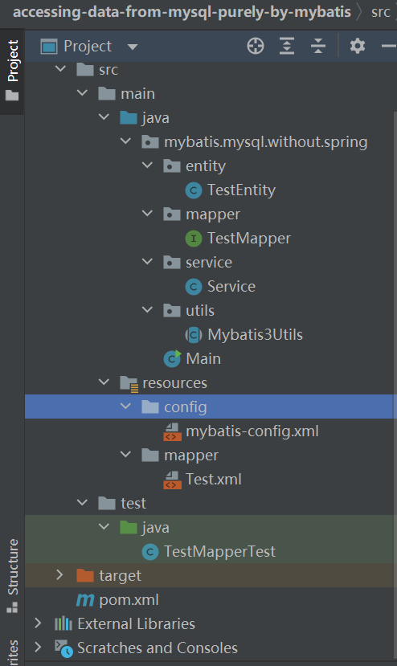

# Accessing-data-from-mysql-purely-by-mybatis（新手向）

## 前言

之前做了Maven+ SpringMVC+ MyBatis +Druid+MySql：https://www.jianshu.com/p/4b285b5b34f8。这次不用spring，甩脱Spring IOC，来一波与Mybatis与Mysql纯纯的激情碰撞。我的项目基础时根据网上的改编的：https://www.cnblogs.com/moy25/p/8455252.html，我多做了一层对增删改查的封装，毕竟不是仅仅做个自己玩的demo。


## 基本概念

- **Mysql**

是个数据库，主要有库，库下由表组成。我们能对数据库与表做增上改查。

- **Mybatis**

Mybatis官网：https://mybatis.org/mybatis-3/

是个java对象与mysql打交道的工具。我重点讲一下。每次要与Mysql数据库会话时，我们要用SqlSessionFactory里的openSession方法创建Sqlsession。构建一个SqlSessionFactory，我们需要一个SqlSessionFactoryBuilder。而 SqlSessionFactoryBuilder 则可以从 XML 配置文件或一个预先配置的 Configuration 实例来构建出 SqlSessionFactory 实例。


## 制作过程

### 文件结构




### 你需要的依赖包

```java
    <dependencies>
        <dependency>
            <groupId>junit</groupId>
            <artifactId>junit</artifactId>
            <version>4.12</version>
            <scope>test</scope>
        </dependency>
        <dependency>
            <groupId>org.mybatis</groupId>
            <artifactId>mybatis</artifactId>
            <version>3.2.3</version>
        </dependency>
        <dependency>
            <groupId>mysql</groupId>
            <artifactId>mysql-connector-java</artifactId>
            <version>5.1.38</version>
        </dependency>
    </dependencies>
```


其中，第一个依赖是用来做单元测试的，第二三个顾名思义。


你需要的Mybatis配置

由上文所述，我们可以先用 XML 配置文件来配置SqlSessionFactoryBuilder 。

我的 XML 配置文件

mybatis-config.xml

```java
<?xml version="1.0" encoding="UTF-8" ?>
<!DOCTYPE configuration
        PUBLIC "-//mybatis.org//DTD Config 3.0//EN"
        "http://mybatis.org/dtd/mybatis-3-config.dtd">
<configuration>
    <typeAliases>
        <!--项目实体类对应的包名-->
        <package name="mybatis.mysql.without.spring.entity"/>
    </typeAliases>
    <!--myql数据库连接信息-->
    <environments default="development">
        <environment id="development">
            <transactionManager type="JDBC"/>
            <dataSource type="POOLED">
    			<!--驱动器-->
                <property name="driver" value="com.mysql.jdbc.Driver"/>
    			<!--myql的url地址，db_example为你创建的库名-->            
    			<property name="url" value="jdbc:mysql://127.0.0.1/db_example?serverTimezone=Asia/Shanghai&amp;useUnicode=true&amp;characterEncoding=utf-8&amp;useSSL=false"/>
    			<!--myql数据库用户账号-->
                <property name="username" value="root"/>
    			<!--myql数据库用户密码-->
                <property name="password" value="root"/>
            </dataSource>
        </environment>
    </environments>
    <!--配置实体映射xml路径-->
    <mappers>
        <mapper resource="mapper/Test.xml"/>
    </mappers>
</configuration>
```

当然，还有很多可以在 XML 文件中配置的选项，上面的示例仅罗列了最关键的部分。 注意 XML 头部的声明，它用来验证 XML 文档的正确性。environment 元素体中包含了事务管理和连接池的配置。mappers 元素则包含了一组映射器（mapper），这些映射器的 XML 映射文件包含了 SQL 代码和映射定义信息。


我们要用它放进SqlSessionFactoryBuilder 来配置SqlSessionFactory。

```java
try {
    Reader reader = Resources.getResourceAsReader("mybatis-config.xml");
    sqlSessionFactory = new SqlSessionFactoryBuilder().build(reader);
} catch (IOException e) {
    throw new RuntimeException(e);
}
```


既然有了 SqlSessionFactory，顾名思义，我们可以从中获得 SqlSession 的实例。我把 SqlSession 的实例放在一个thread中。

```java
public static final SqlSessionFactory sqlSessionFactory;
public static final ThreadLocal<SqlSession> sessionThread = new ThreadLocal();

public static SqlSession getCurrentSqlSession() {
    SqlSession sqlSession = sessionThread.get();
    if (Objects.isNull(sqlSession)) {
        sqlSession = sqlSessionFactory.openSession();
        sessionThread.set(sqlSession);
    }
    return sqlSession;
}
```

可见，如果thread中没有sql映射，那么就从sqlSessionFactory中创建Sqlsession。


与Mysql数据库会话结束时，也要关闭sql映射，清空thread

```java
SqlSession sqlSession = sessionThread.get();
if (Objects.nonNull(sqlSession)) {
    sqlSession.close();
}
sessionThread.set(null);
```


这些放在一个工具类就行了。

### Mybatis3Utils

```java
package mybatis.mysql.without.spring.utils;

import org.apache.ibatis.io.Resources;
import org.apache.ibatis.session.SqlSession;
import org.apache.ibatis.session.SqlSessionFactory;
import org.apache.ibatis.session.SqlSessionFactoryBuilder;

import java.io.IOException;
import java.io.Reader;
import java.util.Objects;

public abstract class Mybatis3Utils {

    public static final SqlSessionFactory sqlSessionFactory;
    public static final ThreadLocal<SqlSession> sessionThread = new ThreadLocal();

    static {
        try {
            Reader reader = Resources.getResourceAsReader("mybatis-config.xml");
            sqlSessionFactory = new SqlSessionFactoryBuilder().build(reader);
        } catch (IOException e) {
            throw new RuntimeException(e);
        }
    }

    public static SqlSession getCurrentSqlSession() {
        SqlSession sqlSession = sessionThread.get();
        if (Objects.isNull(sqlSession)) {
            sqlSession = sqlSessionFactory.openSession();
            sessionThread.set(sqlSession);
        }
        return sqlSession;
    }

    public static void closeCurrentSession() {
        SqlSession sqlSession = sessionThread.get();
        if (Objects.nonNull(sqlSession)) {
            sqlSession.close();
        }
        sessionThread.set(null);
    }
}
```


SqlSession 提供了在数据库执行 SQL 命令所需的所有方法。你可以通过 SqlSession 实例来直接执行已映射的 SQL 语句。


### Test.xml

```java
<?xml version="1.0" encoding="UTF-8"?>
<!DOCTYPE mapper PUBLIC "-//mybatis.org//DTD Mapper 3.0//EN"
        "http://mybatis.org/dtd/mybatis-3-mapper.dtd">

<mapper namespace="mybatis.mysql.without.spring.mapper.TestMapper">
    <select id="listAll" resultType="TestEntity">
        SELECT id,
               create_time createTime,
               modify_time modifyTime,
               content content
        FROM t_test
    </select>

    <select id="count" resultType="int">
        SELECT count(*) FROM t_test
    </select>

    <select id="get" parameterType="int" resultType="TestEntity">
        SELECT id,create_time as createTime,modify_time as modifyTime ,content
        FROM t_test WHERE id=#{id}
    </select>

    <insert id="insert" parameterType="TestEntity" useGeneratedKeys="true"
            keyProperty="id">
        INSERT INTO t_test (create_time,modify_time,content)
        VALUES (#{createTime},#{modifyTime},#{content})
    </insert>

    <update id="update" parameterType="mybatis.mysql.without.spring.entity.TestEntity">
        UPDATE t_test SET modify_time=#{modifyTime}, content=#{content} WHERE id = #{id}
    </update>

    <delete id="delete" parameterType="int">
        DELETE FROM t_test WHERE id = #{id}
    </delete>
</mapper>
```


**namespace命名规则**

**命名解析：**为了减少输入量，MyBatis 对所有具有名称的配置元素（包括语句，结果映射，缓存等）使用了如下的命名解析规则。

- 全限定名（比如 “mybatis.mysql.without.spring.mapper.TestMapper“）将被直接用于查找及使用。
- 短名称（比如 “selectAllThings”）如果全局唯一也可以作为一个单独的引用。 如果不唯一，有两个或两个以上的相同名称（比如 “com.foo.selectAllThings” 和 “com.bar.selectAllThings”），那么使用时就会产生“短名称不唯一”的错误，这种情况下就必须使用全限定名。


至于那些Mybatis映射语句，官网上有。https://mybatis.org/mybatis-3/zh/getting-started.html


我要映射的方法存于TestMapper

### TestMapper

```java
public interface TestMapper {

    List<TestEntity> listAll();

    TestEntity get(Serializable id);

    int insert(TestEntity testEntity);

    int update(TestEntity testEntity);

    int delete(Serializable id);

    int count();
}
```


### 我的Service

```java
public class Service {

    private SqlSession sqlSession;
    private TestMapper testMapper;


    public Service(){
        SqlSession sqlSession = Mybatis3Utils.getCurrentSqlSession();
        TestMapper testMapper = sqlSession.getMapper(TestMapper.class);
        this.sqlSession = sqlSession;
        this.testMapper = testMapper;
    }

    public void insert(TestEntity testEntity){
        testMapper.insert(testEntity);
        sqlSession.commit();//提交事务，是一把锁，若其他人也要提交，就会把它锁住，当然也有权限区分
        Mybatis3Utils.closeCurrentSession();
    }

    
    public void listAll() {
        List<TestEntity> list = testMapper.listAll();
        System.out.println(Arrays.toString(list.toArray()));
        sqlSession.commit();
        Mybatis3Utils.closeCurrentSession();
    }

    
    public void get(Integer id) {
        System.out.println(testMapper.get(id));
        sqlSession.commit();
        Mybatis3Utils.closeCurrentSession();
    }

    public void update(Integer id,TestEntity testEntity) {
        testEntity.setId(id);
        testMapper.update(testEntity);
        sqlSession.commit();
        Mybatis3Utils.closeCurrentSession();
    }

    
    public void delete(Integer id) {
        testMapper.delete(id);
        sqlSession.commit();
        Mybatis3Utils.closeCurrentSession();
    }

    public void count(){
        System.out.println(testMapper.count());
        sqlSession.commit();
        Mybatis3Utils.closeCurrentSession();
    }
    
}
```


可见，只有调用Service中的方法，我才要生成一个Sql映射。等我方法完成了，我再把这个Sql映射销毁。

sqlSession.commit();//提交事务，是一把锁，若其他人也要提交，就会把它锁住，当然也有权限区分


差点忘记我的实体类了

### TestEntity

```java
public class TestEntity {
    private Integer id;
    private Date createTime;
    private Date modifyTime;
    private String content;

    public Integer getId() {
        return id;
    }

    public void setId(Integer id) {
        this.id = id;
    }

    public Date getCreateTime() {
        return createTime;
    }

    public void setCreateTime(Date createTime) {
        this.createTime = createTime;
    }

    public Date getModifyTime() {
        return modifyTime;
    }

    public void setModifyTime(Date modifyTime) {
        this.modifyTime = modifyTime;
    }

    public String getContent() {
        return content;
    }

    public void setContent(String content) {
        this.content = content;
    }

    @Override
    public String toString() {
        return "TestEntity{" +
                "id=" + id +
                ", createTime=" + createTime +
                ", modifyTime=" + modifyTime +
                ", content='" + content + '\'' +
                '}';
    }
}
```


这样，你既可以用单元测试测试接口，也能在启动类上调用，其他人也能调用了。


根据官网上对于作用域与生命周期的阐释，还是用注解构建Sql映射保险。


## 作用域（Scope）和生命周期

理解我们之前讨论过的不同作用域和生命周期类别是至关重要的，因为错误的使用会导致非常严重的并发问题。

------

**提示** **对象生命周期和依赖注入框架**

依赖注入框架可以创建线程安全的、基于事务的 SqlSession 和映射器，并将它们直接注入到你的 bean 中，因此可以直接忽略它们的生命周期。 如果对如何通过依赖注入框架使用 MyBatis 感兴趣，可以研究一下 MyBatis-Spring 或 MyBatis-Guice 两个子项目。

------

### SqlSessionFactoryBuilder

这个类可以被实例化、使用和丢弃，一旦创建了 SqlSessionFactory，就不再需要它了。 因此 SqlSessionFactoryBuilder 实例的最佳作用域是方法作用域（也就是局部方法变量）。 你可以重用 SqlSessionFactoryBuilder 来创建多个 SqlSessionFactory 实例，但最好还是不要一直保留着它，以保证所有的 XML 解析资源可以被释放给更重要的事情。

### SqlSessionFactory

SqlSessionFactory 一旦被创建就应该在应用的运行期间一直存在，没有任何理由丢弃它或重新创建另一个实例。 使用 SqlSessionFactory 的最佳实践是在应用运行期间不要重复创建多次，多次重建 SqlSessionFactory 被视为一种代码“坏习惯”。因此 SqlSessionFactory 的最佳作用域是应用作用域。 有很多方法可以做到，最简单的就是使用单例模式或者静态单例模式。

### SqlSession

每个线程都应该有它自己的 SqlSession 实例。SqlSession 的实例不是线程安全的，因此是不能被共享的，所以它的最佳的作用域是请求或方法作用域。 绝对不能将 SqlSession 实例的引用放在一个类的静态域，甚至一个类的实例变量也不行。 也绝不能将 SqlSession 实例的引用放在任何类型的托管作用域中，比如 Servlet 框架中的 HttpSession。 如果你现在正在使用一种 Web 框架，考虑将 SqlSession 放在一个和 HTTP 请求相似的作用域中。 换句话说，每次收到 HTTP 请求，就可以打开一个 SqlSession，返回一个响应后，就关闭它。 这个关闭操作很重要，为了确保每次都能执行关闭操作，你应该把这个关闭操作放到 finally 块中。 下面的示例就是一个确保 SqlSession 关闭的标准模式：

```java
try (SqlSession session = sqlSessionFactory.openSession()) {
  // 你的应用逻辑代码
}
```

在所有代码中都遵循这种使用模式，可以保证所有数据库资源都能被正确地关闭。

### 映射器实例

映射器是一些绑定映射语句的接口。映射器接口的实例是从 SqlSession 中获得的。虽然从技术层面上来讲，任何映射器实例的最大作用域与请求它们的 SqlSession 相同。但方法作用域才是映射器实例的最合适的作用域。 也就是说，映射器实例应该在调用它们的方法中被获取，使用完毕之后即可丢弃。 映射器实例并不需要被显式地关闭。尽管在整个请求作用域保留映射器实例不会有什么问题，但是你很快会发现，在这个作用域上管理太多像 SqlSession 的资源会让你忙不过来。 因此，最好将映射器放在方法作用域内。就像下面的例子一样：

```Java
try (SqlSession session = sqlSessionFactory.openSession()) {
  BlogMapper mapper = session.getMapper(BlogMapper.class);
  // 你的应用逻辑代码
}
```


虽说由于 Java 注解的一些限制以及某些 MyBatis 映射的复杂性，要使用大多数高级映射（比如：嵌套联合映射），仍然需要使用 XML 配置。但是一般来说我们不会太复杂，因为要考虑系统性能不能太复杂，而它又简单又可以忽略他们的生命周期，我们就来展示一下用注解的方法。

我就举一个例子。


其实很简单，只要改几处：

- **Mybatis配置中要改为直接用TestMapper类作为地址。**

```java
<mappers>
    <mapper class="mybatis.mysql.without.spring.mapper.TestMapper"/>
</mappers>
```

- **加上几个Results和Result类。**

```java
@Documented
@Retention(RetentionPolicy.RUNTIME)
@Target({})
public @interface Results {
    boolean id() default false;
    Result[] value() default {};
}
```

```java
@Documented
@Retention(RetentionPolicy.RUNTIME)
@Target({ElementType.METHOD})
public @interface Result {
    boolean id() default false;

    String column() default "";
    String property() default "";
}
```

- **TestMapper改为注解形式。**

```Java
@Select("select * from t_test")
@Options(useGeneratedKeys = true,keyProperty = "id")
@Results(value = {
        @Result(id = true ,column = "id",property = "id"),
        @Result(id = true ,column = "create_time",property = "createTime"),
        @Result(id = true ,column = "modify_time",property = "modifyTime"),
        @Result(id = true ,column = "content",property = "content")
}
)
```

其中，column是在表中的，property是在对象中的。