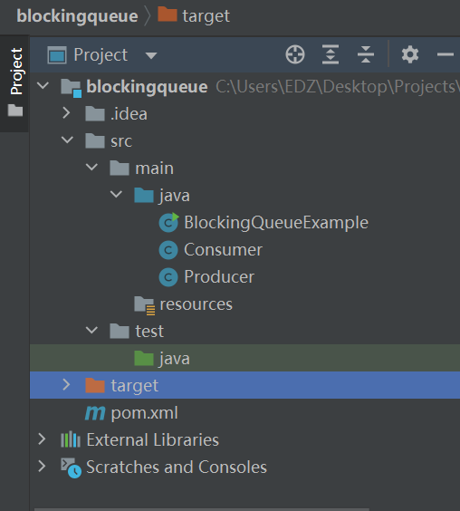

# Blockingqueue-Produce-Consume


## 一、什么是BlockingQueue

BlockingQueue即阻塞队列，从阻塞这个词可以看出，在某些情况下对阻塞队列的访问可能会造成阻塞。被阻塞的情况主要有如下两种：

1. 当队列满了的时候进行入队列操作
2. 当队列空了的时候进行出队列操作
1
2
因此，当一个线程试图对一个已经满了的队列进行入队列操作时，它将会被阻塞，除非有另一个线程做了出队列操作；同样，当一个线程试图对一个空队列进行出队列操作时，它将会被阻塞，除非有另一个线程进行了入队列操作。

在Java中，BlockingQueue的接口位于java.util.concurrent 包中(在Java5版本开始提供)，由上面介绍的阻塞队列的特性可知，阻塞队列是线程安全的。


## 二、BlockingQueue的用法

阻塞队列主要用在生产者/消费者的场景，下面这幅图展示了一个线程生产、一个线程消费的场景：


负责生产的线程不断的制造新对象并插入到阻塞队列中，直到达到这个队列的上限值。队列达到上限值之后生产线程将会被阻塞，直到消费的线程对这个队列进行消费。同理，负责消费的线程不断的从队列中消费对象，直到这个队列为空，当队列为空时，消费线程将会被阻塞，除非队列中有新的对象被插入。


## 三、BlockingQueue接口中的方法

阻塞队列一共有四套方法分别用来进行insert、remove和examine，当每套方法对应的操作不能马上执行时会有不同的反应，下面这个表格就分类列出了这些方法：
asdf

- Throws Exception	Special Value	Blocks	Times Out
  Insert	add(o)	offer(o)	put(o)	offer(o, timeout, timeunit)
  Remove	remove(o)	poll()	take()	poll(timeout, timeunit)
  Examine	element()	peek()		
  这四套方法对应的特点分别是：

  

1. ThrowsException：如果操作不能马上进行，则抛出异常

2. SpecialValue：如果操作不能马上进行，将会返回一个特殊的值，一般是true或者false

3. Blocks:如果操作不能马上进行，操作会被阻塞

4. TimesOut:如果操作不能马上进行，操作会被阻塞指定的时间，如果指定时间没执行，则返回一个特殊值，一般是true或者false

  

  ````
  1. ThrowsException：如果操作不能马上进行，则抛出异常
  2. SpecialValue：如果操作不能马上进行，将会返回一个特殊的值，一般是true或者false
  3. Blocks:如果操作不能马上进行，操作会被阻塞
  4. TimesOut:如果操作不能马上进行，操作会被阻塞指定的时间，如果指定时间没执行，则返回一个特殊值，一般是true或者false
  ````

  

  需要注意的是，我们不能向BlockingQueue中插入null，否则会报NullPointerException。

  原文链接：https://blog.csdn.net/suifeng3051/article/details/48807423


## 文件结构




## 我的代码


### BlockingQueueExample

```java
import java.util.concurrent.ArrayBlockingQueue;
import java.util.concurrent.BlockingQueue;

public class BlockingQueueExample {

    public static void main(String[] args) throws Exception {

        long startTime = System.currentTimeMillis();

        BlockingQueue queue = new ArrayBlockingQueue(1024);

        Producer producer = new Producer(queue);
        Consumer consumer = new Consumer(queue);
        
        new Thread(producer).start();
        new Thread(consumer).start();
//        Thread.sleep(8000);
        long endTime = System.currentTimeMillis();
        System.out.println("程序运行时间：" + (endTime - startTime) + "s");
    }
}
```

ArrayBlockingQueue:

```java
/**
 * Creates an {@code ArrayBlockingQueue} with the given (fixed)
 * capacity and default access policy.
 *
 * @param capacity the capacity of this queue
 * @throws IllegalArgumentException if {@code capacity < 1}
 */
public ArrayBlockingQueue(int capacity) {
    this(capacity, false);
}
```

Thread:

```java
/**
 * Allocates a new {@code Thread} object. This constructor has the same
 * effect as {@linkplain #Thread(ThreadGroup,Runnable,String) Thread}
 * {@code (null, target, gname)}, where {@code gname} is a newly generated
 * name. Automatically generated names are of the form
 * {@code "Thread-"+}<i>n</i>, where <i>n</i> is an integer.
 *
 * @param  target
 *         the object whose {@code run} method is invoked when this thread
 *         is started. If {@code null}, this classes {@code run} method does
 *         nothing.
 */
public Thread(Runnable target) {
    this(null, target, "Thread-" + nextThreadNum(), 0);
}
```


### Consumer

```java
import java.util.concurrent.BlockingQueue;

public class Consumer implements Runnable{

    protected BlockingQueue queue = null;

    public Consumer(BlockingQueue queue) {
        this.queue = queue;
    }

    public void run() {
        try {
            System.out.println(queue.take());
            System.out.println(queue.take());
            System.out.println(queue.take());
        } catch (InterruptedException e) {
            e.printStackTrace();
        }
    }
}
```

BlockingQueue:

A Queue that additionally supports operations that wait for the queue to become non-empty when retrieving an element, and wait for space to become available in the queue when storing an element.
BlockingQueue methods come in four forms, with different ways of handling operations that cannot be satisfied immediately, but may be satisfied at some point in the future: one throws an exception, the second returns a special value (either null or false, depending on the operation), the third blocks the current thread indefinitely until the operation can succeed, and the fourth blocks for only a given maximum time limit before giving up. These methods are summarized in the following table:


### Producer

```java
import java.util.concurrent.BlockingQueue;

public class Producer implements Runnable{

    protected BlockingQueue queue = null;

    public Producer(BlockingQueue queue) {
        this.queue = queue;
    }

    public void run() {
        try {
            queue.put("1");
            Thread.sleep(1000);
            queue.put("2");
            Thread.sleep(1000);
            queue.put("3");
        } catch (InterruptedException e) {
            e.printStackTrace();
        }
    }
}
```

Runnable:

The Runnable interface should be implemented by any class whose instances are intended to be executed by a thread. The class must define a method of no arguments called run.
This interface is designed to provide a common protocol for objects that wish to execute code while they are active. For example, Runnable is implemented by class Thread. Being active simply means that a thread has been started and has not yet been stopped.
In addition, Runnable provides the means for a class to be active while not subclassing Thread. A class that implements Runnable can run without subclassing Thread by instantiating a Thread instance and passing itself in as the target. In most cases, the Runnable interface should be used if you are only planning to override the run() method and no other Thread methods. This is important because classes should not be subclassed unless the programmer intends on modifying or enhancing the fundamental behavior of the class.


InterruptedException:

Thrown when a thread is waiting, sleeping, or otherwise occupied, and the thread is interrupted, either before or during the activity. Occasionally a method may wish to test whether the current thread has been interrupted, and if so, to immediately throw this exception. The following code can be used to achieve this effect:
    if (Thread.interrupted())  // Clears interrupted status!
        throw new InterruptedException();