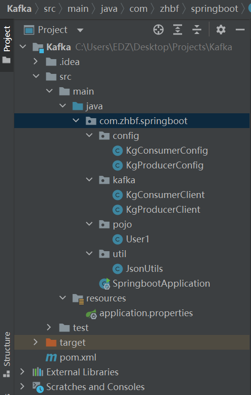

# Kafka-Learning

很可惜，spring官网上的kafka用不了，也不知道为什么。

那就从其他地方了解一下吧。

[Kafka（一）Kafka的简介与架构 - Frankdeng - 博客园 (cnblogs.com)](https://www.cnblogs.com/frankdeng/p/9310684.html)


## 具体实现

给kafka生产一个消息，并且能消费


## 文件结构




## pom.xml

```java
<?xml version="1.0" encoding="UTF-8"?>
<project xmlns="http://maven.apache.org/POM/4.0.0" xmlns:xsi="http://www.w3.org/2001/XMLSchema-instance"
         xsi:schemaLocation="http://maven.apache.org/POM/4.0.0 https://maven.apache.org/xsd/maven-4.0.0.xsd">
    <modelVersion>4.0.0</modelVersion>
    <parent>
        <groupId>org.springframework.boot</groupId>
        <artifactId>spring-boot-starter-parent</artifactId>
        <version>2.1.9.RELEASE</version>
        <relativePath/> <!-- lookup parent from repository -->
    </parent>
    <groupId>com.zhbf</groupId>
    <artifactId>springboot</artifactId>
    <version>0.0.1-SNAPSHOT</version>
    <name>springboot</name>
    <description>Demo project for Spring Boot</description>

    <properties>
        <java.version>1.8</java.version>
    </properties>

    <dependencies>
        <dependency>
            <groupId>org.projectlombok</groupId>
            <artifactId>lombok</artifactId>
            <optional>true</optional>
        </dependency>
        <dependency>
            <groupId>org.springframework.boot</groupId>
            <artifactId>spring-boot-starter-test</artifactId>
            <scope>test</scope>
        </dependency>
        <!--引入kafka依赖-->
        <dependency>
            <groupId>org.springframework.kafka</groupId>
            <artifactId>spring-kafka</artifactId>
        </dependency>
        <dependency>
            <groupId>org.json</groupId>
            <artifactId>json</artifactId>
            <version>20210307</version>
        </dependency>
        <dependency>
            <groupId>com.alibaba</groupId>
            <artifactId>fastjson</artifactId>
            <version>1.2.76</version>
        </dependency>
        <dependency>
            <groupId>org.springframework.boot</groupId>
            <artifactId>spring-boot-autoconfigure</artifactId>
        </dependency>
        <dependency>
            <groupId>org.springframework.boot</groupId>
            <artifactId>spring-boot-starter-web</artifactId>
        </dependency>
        <dependency>
            <groupId>org.springframework.boot</groupId>
            <artifactId>spring-boot-starter-web</artifactId>
        </dependency>
    </dependencies>

    <build>
        <plugins>
            <plugin>
                <groupId>org.springframework.boot</groupId>
                <artifactId>spring-boot-maven-plugin</artifactId>
            </plugin>
        </plugins>
    </build>

</project>
```


## 启动类

```java
package com.zhbf.springboot;

//import com.zhbf.springboot.kafka.KafkaConsumerDemo;
import com.zhbf.springboot.kafka.KgConsumerClient;
import com.zhbf.springboot.kafka.KgProducerClient;
import com.zhbf.springboot.util.JsonUtils;
import org.springframework.boot.SpringApplication;
import org.springframework.boot.autoconfigure.EnableAutoConfiguration;
import org.springframework.boot.autoconfigure.SpringBootApplication;
import org.springframework.boot.autoconfigure.jdbc.DataSourceAutoConfiguration;
import org.springframework.boot.autoconfigure.orm.jpa.HibernateJpaAutoConfiguration;
import org.springframework.context.ConfigurableApplicationContext;
import org.springframework.context.annotation.ComponentScan;
import org.springframework.stereotype.Component;
import org.springframework.stereotype.Service;

import java.util.Arrays;
import java.util.HashMap;
import java.util.List;
import java.util.Map;
import java.util.concurrent.ExecutionException;

@SpringBootApplication
public class SpringbootApplication {
    private final static String TOPIC = "nyz";
// private final static String TOPIC = "zhaodeng02";

    public static void main(String[] args) {
        ConfigurableApplicationContext context = SpringApplication.run(SpringbootApplication.class, args);

        // 1.管理
//    KgKafkaManagementClient managementClient = context.getBean(KgKafkaManagementClient.class);
//    manage(managementClient);

        // 2.创造
        KgProducerClient producerClient = context.getBean(KgProducerClient.class);
        produce(producerClient);

//     3.读取
        KgConsumerClient consumerClient = context.getBean(KgConsumerClient.class);
        consumer(consumerClient);

        System.out.println("this is a good idea,over....");
        context.close();
    }

    /**
     * 消费一条消息
     *
     * @param consumerClient 消费端
     */

    private static void consumer(KgConsumerClient consumerClient) {
        consumerClient.subscribe(TOPIC);

        List<String> results = consumerClient.poll();
        for (String result : results) {
            System.out.println(JsonUtils.parse(result));//以JSONObject形式输出string类型的result
        }
        consumerClient.close();
    }

    /**
     * 生产一条消息
     *
     * @param client 生产端
     */
    private static void produce(KgProducerClient client) {
        Map<String, Object> map = new HashMap<>();
        map.put("name", "照登");
        map.put("sex", "1");
        map.put("百年", "华诞");
        map.put("hobby", Arrays.asList("羽毛球", "篮球", "足球", "爬山", "游泳", "bj"));
        Map<String, Object> property = new HashMap<>();
        property.put("人名", "小王");
        property.put("知识库", Arrays.asList("原子知识", "综合知识", "beauty"));
        map.put("property", property);
        client.send(TOPIC, null, map);
        System.out.print(map);
        client.close();
    }
}
```


application.properties

```jav
spring.application.name=kg-kafka.properties
bootstrap.servers=192.168.4.31:9092//用于 创建与 Kafka broker 服务器的 Socket 连接 。
kafka.topic.user=nyz
#broker.id=0
#log.dirs=/kafka/kafka-logs
#zookeeper.connect=192.168.4.31:2181
# producer
acks=-1//acks指定了必须有多少个分区副本接收到了消息，生产者才会认为消息是发送成功的。
retries=10//服务端收到错误消息是的重试次数
batch.size=16384//一批数据内存大小
linger.ms=100//该参数指定了生产者在发送批次之前等待更多消息加入批次的时间。
buffer.memory=33554432//设置生产者内存缓冲区的大小
max.block.ms=100000//  该参数指定了在调用send()方法或使用partitionFor() 方法获取元数据时生产者的阻塞
#时间。
key.serializer=org.apache.kafka.common.serialization.StringSerializer//为消息的key序列化
value.serializer=org.apache.kafka.common.serialization.StringSerializer//为消息的value序列化
#Java序列化就是指把Java对象转换为字节序列的过程

#Java反序列化就是指把字节序列恢复为Java对象的过程。
#consummer
fetch.max.wait.ms=10000//单次最长获取消息的时间
enable.auto.commit=false//该参数指定 consumer 是否自动提交位移 。false时，用户需要手动提交位移。
key.deserializer=org.apache.kafka.common.serialization.StringDeserializer//为消息的key反序列化
value.deserializer=org.apache.kafka.common.serialization.StringDeserializer//为消息的value反序列化
auto.offset.reset=earliest//即 consumer 要消费的消息的位移不在当前消息日志的合理区间范围）时 Kafka 的应对策略 。 特别要注意这里的无位移信息或位移越界，只有满足这两个条件中的任何一个时该参数才有效果 。
```

这里的注释只是解释，放到代码里是不能用的，需要手动删除。


## 消费客户

```java
package com.zhbf.springboot.kafka;

import com.zhbf.springboot.config.KgConsumerConfig;
import lombok.extern.slf4j.Slf4j;
import org.apache.kafka.clients.consumer.*;
import org.springframework.stereotype.Component;

import javax.annotation.PreDestroy;
import java.time.Duration;
import java.time.temporal.ChronoUnit;
import java.util.*;

/**
 * @author zhaodeng
 * @date 2021/6/15 15:09
 * @desc
 */
@Component
@Slf4j
public class KgConsumerClient {

    private final KafkaConsumer<String, String> consumer;

    private final KgConsumerConfig config;

    public KgConsumerClient(KgConsumerConfig config) {
        this.config = config;
        consumer = init();
    }

    public void subscribe(String topic) {
        consumer.subscribe(Collections.singleton(topic));
    }

    public void unsubscribe() {
        consumer.unsubscribe();
    }

    public List<String> poll() {//拿消息
        while (true) {
            log.info("poll topic data");
            ConsumerRecords<String, String> records =
                    consumer.poll(Duration.of(10000, ChronoUnit.MILLIS));
            if (!records.isEmpty()) {
                List<String> result = new ArrayList<>(records.count());
                for (ConsumerRecord<String, String> record : records) {
                    result.add(record.value());//只要value
                }
                commitAsync();//保证异步
                return result;
            }
        }
    }

    private void commitAsync() {//保证异步
        consumer.commitAsync((map, e) -> {
            if (e != null) {
                log.error("commit error", e);
            }
        });
    }

    @PreDestroy
    public void close() {
        consumer.close();
    }

    private KafkaConsumer<String, String> init() {
        Properties properties = new Properties();

        properties.put(ConsumerConfig.BOOTSTRAP_SERVERS_CONFIG, config.getBootstrapServers());
        properties.put(ConsumerConfig.GROUP_ID_CONFIG, UUID.randomUUID().toString());
        properties.put(ConsumerConfig.FETCH_MAX_WAIT_MS_CONFIG, config.getFetchMaxWaitMs());
        properties.put(ConsumerConfig.ENABLE_AUTO_COMMIT_CONFIG, config.getEnableAutoCommit());
        properties.put(ConsumerConfig.KEY_DESERIALIZER_CLASS_CONFIG, config.getKeyDeserializer());
        properties.put(ConsumerConfig.VALUE_DESERIALIZER_CLASS_CONFIG, config.getValueDeserializer());
        properties.put(ConsumerConfig.AUTO_OFFSET_RESET_CONFIG, config.getAutoOffsetReset());

        return new KafkaConsumer<>(properties);
    }
}
```

KafkaConsumer:

A client that consumes records from a Kafka cluster.

Properties:

The Properties class represents a persistent set of properties. The Properties can be saved to a stream or loaded from a stream. Each key and its corresponding value in the property list is a string.
A property list can contain another property list as its "defaults"; this second property list is searched if the property key is not found in the original property list.

详细了解还是要在项目里看


## 生产客户

```java
package com.zhbf.springboot.kafka;

import com.zhbf.springboot.config.KgProducerConfig;
import com.zhbf.springboot.util.JsonUtils;
import org.apache.kafka.clients.producer.KafkaProducer;
import org.apache.kafka.clients.producer.Producer;
import org.apache.kafka.clients.producer.ProducerConfig;
import org.apache.kafka.clients.producer.ProducerRecord;
import org.springframework.stereotype.Component;

import javax.annotation.PreDestroy;
import java.util.Objects;
import java.util.Properties;
import java.util.concurrent.atomic.AtomicLong;

/**
 * @author zhaodeng
 * @date 2021/6/15 15:08
 * @desc
 */
@Component
public class KgProducerClient {
    private final Producer<String, String> producer;

    private final KgProducerConfig config;

    private String topic;

    private final AtomicLong atomicLong;//对长整型做原子操作？

    public KgProducerClient(KgProducerConfig producerConfig) {
        this.config = producerConfig;
        producer = init();
        atomicLong = new AtomicLong();
    }

    public void setTopic(String topic) {
        this.topic = topic;
    }

    public void removeTopic() {
        this.topic = null;
    }


    public void send(Object value) {
        send(topic, String.valueOf(atomicLong.getAndIncrement()), value);
    }

    public void send(String key, Object value) {
        send(topic, key, value);
    }

    public void send(String topic, String key, Object value) {
        if (Objects.isNull(key)) {//key自增
            key = Long.toString(atomicLong.getAndIncrement());
        }
        String v = JsonUtils.object2String(value);//将value对象转化为Json字符串。
        producer.send(new ProducerRecord<>(topic, key, v));
    }

    @PreDestroy
    public void close() {
        producer.close();
    }

    public Producer<String, String> init() {
        Properties properties = new Properties();

        properties.put(ProducerConfig.BOOTSTRAP_SERVERS_CONFIG, config.getBootstrapServers());
        properties.put(ProducerConfig.ACKS_CONFIG, config.getAcks());
        properties.put(ProducerConfig.RETRIES_CONFIG, config.getRetries());
        properties.put(ProducerConfig.BATCH_SIZE_CONFIG, config.getBatchSize());
        properties.put(ProducerConfig.LINGER_MS_CONFIG, config.getLingerMs());
        properties.put(ProducerConfig.BUFFER_MEMORY_CONFIG, config.getBufferMemory());
        properties.put(ProducerConfig.KEY_SERIALIZER_CLASS_CONFIG, config.getKeySerializer());
        properties.put(ProducerConfig.VALUE_SERIALIZER_CLASS_CONFIG, config.getValueSerializer());
        properties.put(ProducerConfig.MAX_BLOCK_MS_CONFIG, config.getMaxBlockMs());

        return new KafkaProducer<>(properties);
    }
}
```

ProducerRecord：

Create a record to be sent to Kafka

KafkaProducer:

A Kafka client that publishes records to the Kafka cluster.
The producer is thread safe and sharing a single producer instance across threads will generally be faster than having multiple instances

Producer：

The interface for the KafkaProducer

```java
/**
 * A producer is instantiated by providing a set of key-value pairs as configuration. Valid configuration strings
 * are documented <a href="http://kafka.apache.org/documentation.html#producerconfigs">here</a>.
 * <p>
 * Note: after creating a {@code KafkaProducer} you must always {@link #close()} it to avoid resource leaks.
 * @param properties   The producer configs
 */
public KafkaProducer(Properties properties) {
    this(new ProducerConfig(properties), null, null, null, null);
}
```


## 消费客户配置

```java
package com.zhbf.springboot.config;

import lombok.Data;
import org.springframework.beans.factory.annotation.Value;
import org.springframework.context.annotation.Configuration;

/**
 * @author zhaodeng
 * @date 2021/6/15 15:21
 * @desc
 */
@Data
@Configuration
public class KgConsumerConfig {
    @Value("${bootstrap.servers}")
    private String bootstrapServers;

    @Value("${fetch.max.wait.ms}")
    private String fetchMaxWaitMs;

    @Value("${enable.auto.commit}")
    private String enableAutoCommit;

    @Value("${key.deserializer}")
    private String keyDeserializer;

    @Value("${value.deserializer}")
    private String valueDeserializer;

    @Value("${auto.offset.reset}")
    private String autoOffsetReset;
}
```


## 生产客户配置

```java
package com.zhbf.springboot.config;

import lombok.Data;
import org.springframework.beans.factory.annotation.Value;
import org.springframework.context.annotation.Configuration;

/**
 * @author zhaodeng
 * @date 2021/6/15 15:21
 * @desc
 */
@Data
@Configuration
public class KgProducerConfig {
    @Value("${bootstrap.servers}")
    private String bootstrapServers;

    @Value("${acks}")
    private String acks;

    @Value("${retries}")
    private String retries;

    @Value("${batch.size}")
    private String batchSize;

    @Value("${linger.ms}")
    private String lingerMs;

    @Value("${buffer.memory}")
    private String bufferMemory;

    @Value("${key.serializer}")
    private String keySerializer;

    @Value("${value.serializer}")
    private String valueSerializer;

    @Value("${max.block.ms}")
    private String maxBlockMs;
}
```


## pojo

```java
package com.zhbf.springboot.pojo;

public class User1 {
    Integer id ;
    String name;
    Integer age;

    public Integer getId() {
        return id;
    }

    public void setId(Integer id) {
        this.id = id;
    }

    public String getName() {
        return name;
    }

    public void setName(String name) {
        this.name = name;
    }

    public Integer getAge() {
        return age;
    }

    public void setAge(Integer age) {
        this.age = age;
    }
}
```


## 工具类

```java
package com.zhbf.springboot.util;

import com.alibaba.fastjson.JSON;
import org.json.JSONObject;


/**
 * @author zhaodeng
 * @date 2021/6/16 15:50
 * @desc
 */
public class JsonUtils {
    public static String object2String(Object o) {
        return JSON.toJSONString(o);//JSON.parseObject，是将Json字符串转化为相应的对象；JSON.toJSONString则是将对象转化为Json字符串。
                                    //https://www.jianshu.com/p/49b5aed501c1
    }

    public static Object parse(String json) {
        JSONObject object = new JSONObject(json);
        return object.toMap();
    }

}
```

