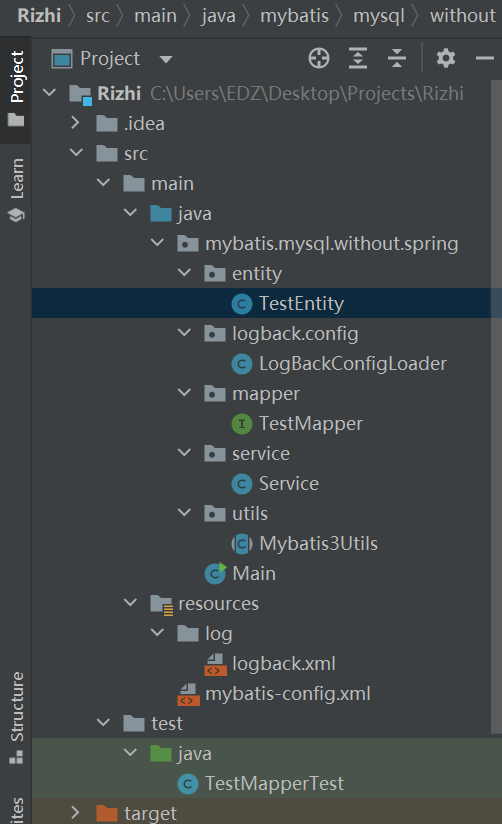
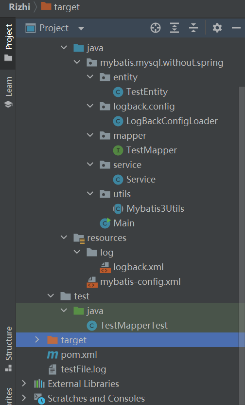

# Logback日志

## 前言

在JAVA开发中，我们会遇到各种各样的bug，怎么样快速了解自己的bug，需要知道发生bug的地点时间以及其他关于bug的信息。Logback就是一个非常好的满足这些要求的工具。我会根据一些应用场景来记录一下使用方法。


## 官网

http://logback.qos.ch/index.html，和这官网有点寒酸简陋，我用下来只有日志报错时，要查询相关原因才会用的到一点。


## 文件结构






注意：

mybatis-config.xml最好放在config目录下，别像我这么放。

## 依赖

```java
<dependency>
    <groupId>ch.qos.logback</groupId>
    <artifactId>logback-core</artifactId>
    <version>1.2.3</version>
</dependency>
<dependency>
    <groupId>ch.qos.logback</groupId>
    <artifactId>logback-classic</artifactId>
    <version>1.2.3</version>
</dependency>
<dependency>
    <groupId>org.slf4j</groupId>
    <artifactId>slf4j-api</artifactId>
    <version>1.7.30</version>
</dependency>
```


引用一下：https://www.cnblogs.com/ryelqy/p/10314147.html。


### **logback的配置介绍**

- #### Logger、appender及layout

　　Logger作为日志的记录器，把它关联到应用的对应的context上后，主要用于存放日志对象，也可以定义日志类型、级别。
　　Appender主要用于指定日志输出的目的地，目的地可以是控制台、文件、远程套接字服务器、 MySQL、PostreSQL、 Oracle和其他数据库、 JMS和远程UNIX Syslog守护进程等。 
　　Layout 负责把事件转换成字符串，格式化的日志信息的输出。

- #### logger context

　　各个logger 都被关联到一个 LoggerContext，LoggerContext负责制造logger，也负责以树结构排列各logger。其他所有logger也通过org.slf4j.LoggerFactory 类的静态方法getLogger取得。 getLogger方法以 logger名称为参数。用同一名字调用LoggerFactory.getLogger 方法所得到的永远都是同一个logger对象的引用。

- #### 有效级别及级别的继承

　　Logger 可以被分配级别。级别包括：TRACE、DEBUG、INFO、WARN 和 ERROR，定义于ch.qos.logback.classic.Level类。如果 logger没有被分配级别，那么它将从有被分配级别的最近的祖先那里继承级别。root logger 默认级别是 DEBUG。

- #### 打印方法与基本的选择规则

　　打印方法决定记录请求的级别。例如，如果 L 是一个 logger 实例，那么，语句 L.info("..")是一条级别为 INFO的记录语句。记录请求的级别在高于或等于其 logger 的有效级别时被称为被启用，否则，称为被禁用。记录请求级别为 p，其 logger的有效级别为 q，只有则当 p>=q时，该请求才会被执行。
该规则是 logback 的核心。级别排序为： TRACE < DEBUG < INFO < WARN < ERROR

 

### 系统找寻logback配置文件规则

1. 尝试在 classpath下查找文件logback-test.xml；
2. 如果文件不存在，则查找文件logback.xml；
3. 如果两个文件都不存在，logback用BasicConfigurator自动对自己进行配置，这会导致记录输出到控制台。


其实，这些顺序在日志里也能打印出来，自己看就行。


## logback配置文件


首先，我们希望在控制台打印日志。

```java
<?xml version="1.0" encoding="UTF-8"?>
<!--
    Example LOGBACK Configuration File

http://logback.qos.ch/manual/configuration.html

   -->
<configuration>
    <appender name="STDOUT" class="ch.qos.logback.core.ConsoleAppender">
        <encoder>
    　　　　　　<pattern>%d{yyyy-MM-dd HH:mm:ss.SSS} [%thread] %-5level %logger{35} %L - %msg %n</pattern>
    　　 </encoder>
    </appender>
    <root level="DEBUG">
		<appender-ref ref="STDOUT" />
    </root>
</configuration>
```

<configuration>根节点

<appender name="STDOUT" class="ch.qos.logback.core.ConsoleAppender">指明了Appender名称以及它发送的日志地址知控制台。

<encoder>解码器

<pattern>指明了日志输出格式，具体语言规范网上有。

<root level="DEBUG">指明跟级别的日志指能输出Degub以上级别的日志。

<appender-ref ref="STDOUT" />指明系统要用名为STDOUT的日志打印。


我们还希望能在一些文件中打印日志。

```java
<appender name="FILE" class="ch.qos.logback.core.FileAppender">
     <file>testFile.log</file>
     <append>true</append>
     <encoder>
        　　<pattern>%d{HH:mm:ss.SSS} [%thread] %-5level %logger{35} - %msg %n</pattern>
     </encoder>
</appender>
```

<file>文件名

<append>true</append>加日志，历史日志保留。


我还希望能按包把日志按照不同级别打印到不同文件里。

```java
<logger name="mybatis.mysql.without.spring" level="info">
    <appender-ref ref="STDOUT"/>
</logger>
<logger name="mybatis.mysql.without.spring.service" level="info">
    <appender-ref ref="STDOUT"/>
</logger>
```

<logger name="mybatis.mysql.without.spring" level="info">指明了包的地址以及设置的日志等级。由于是info，所以没有dubug与trace。

由于这两个包是从属关系，所以service包内的日志会被打印两遍。


我们还可以按照日志等级不同打印到不同文件中，并且按时清空日志文件。

```java
<appender name="FILE-DEBUG" class="ch.qos.logback.core.rolling.RollingFileAppender">

    <file>/logback/log/test-debug.log</file>
    <rollingPolicy class="ch.qos.logback.core.rolling.TimeBasedRollingPolicy">
        <fileNamePattern>/logs/test-debug-%d{yyyy-MM-dd}.log</fileNamePattern>
        <maxHistory>30</maxHistory>
    </rollingPolicy>
    <encoder>
        <pattern>%d{HH:mm:ss.SSS} [%thread] %-5level %logger{35} - %msg %n</pattern>
    </encoder>

    <!-- filter过滤器，DEBUG -->
    <filter class="ch.qos.logback.classic.filter.LevelFilter">
        <level>DEBUG</level>
        <onMatch>ACCEPT</onMatch>
        <onMismatch>DENY</onMismatch>
    </filter>
</appender>
```

<rollingPolicy class="ch.qos.logback.core.rolling.TimeBasedRollingPolicy">是个按时清空滚动日志的功能。这里是设定每30天清空。

<filter class="ch.qos.logback.classic.filter.LevelFilter">设定按照的日志等级。这里是debug。


如果我们配置文件不直接在resources下（系统默认地址），而是在别的地方，我们也有方法手动定位到Logback.xml配置文件。

```java
public class Main{

    private static final Logger logger = LoggerFactory.getLogger(Main.class);

    public static void main(String[] args) throws IOException, JoranException {
        LoggerContext lc = (LoggerContext)LoggerFactory.getILoggerFactory();
        JoranConfigurator configurator = new JoranConfigurator();
        configurator.setContext(lc);
        lc.reset();
        try {
            configurator.doConfigure("src/main/resources/log/logback.xml");
        } catch (JoranException e) {
            e.printStackTrace();
        }
        StatusPrinter.printInCaseOfErrorsOrWarnings(lc);
        System.out.println("===================");
        logger.debug("Hello {}","debug message");

        TestEntity testEntity = new TestEntity();
        testEntity.setCreateTime(new Date());
        testEntity.setModifyTime(new Date());
        testEntity.setContent("我是2");
        System.out.println(testEntity);

        logger.debug("debug");
        logger.info("info");
        logger.warn("warn");
        logger.error("error");

        Service service = new Service();
        service.insert(testEntity);
        System.out.println("ok");

    }
}
```

LoggerContext把许多logback-classic组件基于一身，可以用于跟踪配置文件。

JoranConfigurator增加了与logback-classic有关的功能。

setContext更新context。


## pom.xml

```java
<?xml version="1.0" encoding="UTF-8"?>
<project xmlns="http://maven.apache.org/POM/4.0.0"
         xmlns:xsi="http://www.w3.org/2001/XMLSchema-instance"
         xsi:schemaLocation="http://maven.apache.org/POM/4.0.0 http://maven.apache.org/xsd/maven-4.0.0.xsd">
    <modelVersion>4.0.0</modelVersion>

    <groupId>org.example</groupId>
    <artifactId>accessing-data-from-mysql-purely-by-mybatis</artifactId>
    <version>1.0-SNAPSHOT</version>
    <build>
        <plugins>
            <plugin>
                <groupId>org.apache.maven.plugins</groupId>
                <artifactId>maven-compiler-plugin</artifactId>
                <configuration>
                    <source>8</source>
                    <target>8</target>
                </configuration>
            </plugin>
        </plugins>
    </build>

    <properties>
        <java.version>1.8</java.version>
    </properties>

    <dependencies>
        <dependency>
            <groupId>org.jboss</groupId>
            <artifactId>jboss-vfs</artifactId>
            <version>3.2.15.Final</version>
        </dependency>

        <dependency>
            <groupId>ch.qos.logback</groupId>
            <artifactId>logback-core</artifactId>
            <version>1.2.3</version>
        </dependency>
        <dependency>
            <groupId>ch.qos.logback</groupId>
            <artifactId>logback-classic</artifactId>
            <version>1.2.3</version>
        </dependency>
        <dependency>
            <groupId>org.slf4j</groupId>
            <artifactId>slf4j-api</artifactId>
            <version>1.7.30</version>
        </dependency>
        <dependency>
            <groupId>junit</groupId>
            <artifactId>junit</artifactId>
            <version>4.12</version>
            <scope>test</scope>
        </dependency>
        <dependency>
            <groupId>org.mybatis</groupId>
            <artifactId>mybatis</artifactId>
            <version>3.2.3</version>
        </dependency>
        <dependency>
            <groupId>mysql</groupId>
            <artifactId>mysql-connector-java</artifactId>
            <version>5.1.38</version>
        </dependency>
    </dependencies>

</project>
```


## TestEntity

```java
package mybatis.mysql.without.spring.entity;


import java.io.Serializable;
import java.util.Date;

/**
 * [Project]:moy-gradle-project  <br/>
 * [Email]:moy25@foxmail.com  <br/>
 * [Date]:2018/2/20  <br/>
 * [Description]:  <br/>
 *
 * @author YeXiangYang
 */
public class TestEntity implements Serializable {
    private Integer id;
    private Date createTime;
    private Date modifyTime;
    private String content;

    public Integer getId() {
        return id;
    }

    public void setId(Integer id) {
        this.id = id;
    }

    public Date getCreateTime() {
        return createTime;
    }

    public void setCreateTime(Date createTime) {
        this.createTime = createTime;
    }

    public Date getModifyTime() {
        return modifyTime;
    }

    public void setModifyTime(Date modifyTime) {
        this.modifyTime = modifyTime;
    }

    public String getContent() {
        return content;
    }

    public void setContent(String content) {
        this.content = content;
    }

    @Override
    public String toString() {
        return "TestEntity{" +
                "id=" + id +
                ", createTime=" + createTime +
                ", modifyTime=" + modifyTime +
                ", content='" + content + '\'' +
                '}';
    }
}
```


## LogBackConfigLoader

```java
package mybatis.mysql.without.spring.logback.config;


import java.io.File;
import java.io.IOException;

import org.slf4j.LoggerFactory;

import ch.qos.logback.classic.LoggerContext;
import ch.qos.logback.classic.joran.JoranConfigurator;
import ch.qos.logback.core.joran.spi.JoranException;
import ch.qos.logback.core.util.StatusPrinter;
/**
 * @author create by yingjie.chen on 2018/5/17.
 * @version 2018/5/17 16:08
 */
public class LogBackConfigLoader {
    public static void load (String externalConfigFileLocation) throws IOException, JoranException{
        LoggerContext lc = (LoggerContext) LoggerFactory.getILoggerFactory();

        File externalConfigFile = new File(externalConfigFileLocation);
        if(!externalConfigFile.exists()){
            throw new IOException("Logback External Config File Parameter does not reference a file that exists");
        }else{
            if(!externalConfigFile.isFile()){
                throw new IOException("Logback External Config File Parameter exists, but does not reference a file");
            }else{
                if(!externalConfigFile.canRead()){
                    throw new IOException("Logback External Config File exists and is a file, but cannot be read.");
                }else{
                    JoranConfigurator configurator = new JoranConfigurator();
                    configurator.setContext(lc);
                    lc.reset();
                    configurator.doConfigure(externalConfigFileLocation);
                    StatusPrinter.printInCaseOfErrorsOrWarnings(lc);
                }
            }
        }
    }
}
```


## TestMapper

```java
package mybatis.mysql.without.spring.mapper;


import mybatis.mysql.without.spring.entity.TestEntity;
import org.apache.ibatis.annotations.*;

import java.io.Serializable;
import java.util.List;

/**
 * [Project]:moy-gradle-project  <br/>
 * [Email]:moy25@foxmail.com  <br/>
 * [Date]:2018/2/20  <br/>
 * [Description]:  <br/>
 *
 * @author YeXiangYang
 */
public interface TestMapper {

    @Select("select * from t_test")
    @Options(useGeneratedKeys = true,keyProperty = "id")
    @Results(value = {
            @Result(id = true ,column = "id",property = "id"),
            @Result(id = true ,column = "create_time",property = "createTime"),
            @Result(id = true ,column = "modify_time",property = "modifyTime"),
            @Result(id = true ,column = "content",property = "content")
    }
    )
    List<TestEntity> listAll();

    TestEntity get(Serializable id);

    int insert(TestEntity testEntity);

    int update(TestEntity testEntity);

    int delete(Serializable id);

    int count();
}
```


## Service

```java
package mybatis.mysql.without.spring.service;

import mybatis.mysql.without.spring.entity.TestEntity;
import mybatis.mysql.without.spring.mapper.TestMapper;
import mybatis.mysql.without.spring.utils.Mybatis3Utils;
import org.slf4j.Logger;
import org.slf4j.LoggerFactory;
import org.apache.ibatis.session.SqlSession;

import java.util.Arrays;
import java.util.List;

public class Service {
    private Logger logger = LoggerFactory.getLogger(Service.class);

    private SqlSession sqlSession;
    private TestMapper testMapper;


    public Service(){
        SqlSession sqlSession = Mybatis3Utils.getCurrentSqlSession();
        TestMapper testMapper = sqlSession.getMapper(TestMapper.class);
        this.sqlSession = sqlSession;
        this.testMapper = testMapper;
    }

    public void insert(TestEntity testEntity){
        try{
            testMapper.insert(testEntity);
            sqlSession.commit();//提交事务，是一把锁，若其他人也要提交，就会把它锁住，当然也有权限区分
            Mybatis3Utils.closeCurrentSession();
        }catch (Exception e){
            logger.info(e.getMessage());// TRACE < DEBUG < INFO < WARN < ERROR
        }
        finally {
            logger.debug("debug");
            logger.info("info");
            logger.warn("warn");
            logger.error("error");
        }

    }

    
    public void listAll() {
        List<TestEntity> list = testMapper.listAll();
        System.out.println(Arrays.toString(list.toArray()));
        sqlSession.commit();
        Mybatis3Utils.closeCurrentSession();
    }

    
    public void get(Integer id) {
        System.out.println(testMapper.get(id));
        sqlSession.commit();
        Mybatis3Utils.closeCurrentSession();
    }

    public void update(Integer id,TestEntity testEntity) {
        testEntity.setId(id);
        testMapper.update(testEntity);
        sqlSession.commit();
        Mybatis3Utils.closeCurrentSession();
    }

    
    public void delete(Integer id) {
        testMapper.delete(id);
        sqlSession.commit();
        Mybatis3Utils.closeCurrentSession();
    }

    public void count(){
        System.out.println(testMapper.count());
        sqlSession.commit();
        Mybatis3Utils.closeCurrentSession();
    }

}
```

Logger:

The org.slf4j.Logger interface is the main user entry point of SLF4J API. It is expected that logging takes place through concrete implementations of this interface.


LoggerFactory:

The LoggerFactory is a utility class producing Loggers for various logging APIs, most notably for log4j, logback and JDK 1.4 logging. Other implementations such as NOPLogger and SimpleLogger are also supported.


LoggerFactory is essentially a wrapper around an ILoggerFactory instance bound with LoggerFactory at compile time.

Please note that all methods in LoggerFactory are static.


## Mybatis3Utils

```java
package mybatis.mysql.without.spring.utils;

import org.apache.ibatis.io.Resources;
import org.apache.ibatis.session.SqlSession;
import org.apache.ibatis.session.SqlSessionFactory;
import org.apache.ibatis.session.SqlSessionFactoryBuilder;

import java.io.IOException;
import java.io.Reader;
import java.util.Objects;

public abstract class Mybatis3Utils {

    public static final SqlSessionFactory sqlSessionFactory;
    public static final ThreadLocal<SqlSession> sessionThread = new ThreadLocal();

    static {
        try {
            Reader reader = Resources.getResourceAsReader("mybatis-config.xml");
            sqlSessionFactory = new SqlSessionFactoryBuilder().build(reader);
        } catch (IOException e) {
            throw new RuntimeException(e);
        }
    }

    public static SqlSession getCurrentSqlSession() {
        SqlSession sqlSession = sessionThread.get();
        if (Objects.isNull(sqlSession)) {
            sqlSession = sqlSessionFactory.openSession();
            sessionThread.set(sqlSession);
        }
        return sqlSession;
    }

    public static void closeCurrentSession() {
        SqlSession sqlSession = sessionThread.get();
        if (Objects.nonNull(sqlSession)) {
            sqlSession.close();
        }
        sessionThread.set(null);
    }
}
```

ThreadLocal:

This class provides thread-local variables. These variables differ from their normal counterparts in that each thread that accesses one (via its get or set method) has its own, independently initialized copy of the variable. ThreadLocal instances are typically private static fields in classes that wish to associate state with a thread (e.g., a user ID or Transaction ID).


## mybatis-config.xml

```java
<?xml version="1.0" encoding="UTF-8" ?>
<!DOCTYPE configuration
        PUBLIC "-//mybatis.org//DTD Config 3.0//EN"
        "http://mybatis.org/dtd/mybatis-3-config.dtd">
<configuration>
    <typeAliases>
        <!--项目实体类对应的包名-->
        <package name="mybatis.mysql.without.spring.entity"/>
    </typeAliases>
    <!--myql数据库连接信息-->
    <environments default="development">
        <environment id="development">
            <transactionManager type="JDBC"/>
            <dataSource type="POOLED">
                <property name="driver" value="com.mysql.jdbc.Driver"/>
                <property name="url" value="jdbc:mysql://127.0.0.1/db_example?serverTimezone=Asia/Shanghai&amp;useUnicode=true&amp;characterEncoding=utf-8&amp;useSSL=false"/>
                <property name="username" value="root"/>
                <property name="password" value="root"/>
            </dataSource>
        </environment>
    </environments>
    <!--配置实体映射xml路径-->
    <mappers>
        <mapper class="mybatis.mysql.without.spring.mapper.TestMapper"/>
    </mappers>
</configuration>
```


## TestMapperTest

```java
import mybatis.mysql.without.spring.entity.TestEntity;
import mybatis.mysql.without.spring.mapper.TestMapper;
import mybatis.mysql.without.spring.utils.Mybatis3Utils;
import org.apache.ibatis.session.SqlSession;
import org.junit.After;
import org.junit.Before;
import org.junit.Test;

import java.util.Arrays;
import java.util.Date;
import java.util.List;


/**
 * [Project]:moy-gradle-project  <br/>
 * [Email]:moy25@foxmail.com  <br/>
 * [Date]:2018/2/20  <br/>
 * [Description]:  <br/>
 *
 * @author YeXiangYang
 */
public class TestMapperTest {

    SqlSession sqlSession;
    TestMapper testMapper;

    @Before
    public void before() {
        sqlSession = Mybatis3Utils.getCurrentSqlSession();
        testMapper = sqlSession.getMapper(TestMapper.class);
    }

    @After
    public void after() {
        Mybatis3Utils.closeCurrentSession();
    }

    
    public void insert() {
        TestEntity entity = new TestEntity();
        entity.setCreateTime(new Date());
        entity.setModifyTime(new Date());
        entity.setContent("我是内容");
        System.out.println(testMapper.insert(entity));
        sqlSession.commit();
    }

    
    public void count() {
        System.out.println(testMapper.count());
    }

    
    public void list() {
        List<TestEntity> list = testMapper.listAll();
        System.out.println(Arrays.toString(list.toArray()));
    }

    
    public void get() {
        System.out.println(testMapper.get(1));
    }

    
    public void update(TestEntity testEntity) {

        testMapper.update(testEntity);
        sqlSession.commit();
    }

    
    public void delete() {
        testMapper.delete(1);
        sqlSession.commit();
    }
}
```

SqlSession:

The primary Java interface for working with MyBatis. Through this interface you can execute commands, get mappers and manage transactions.


