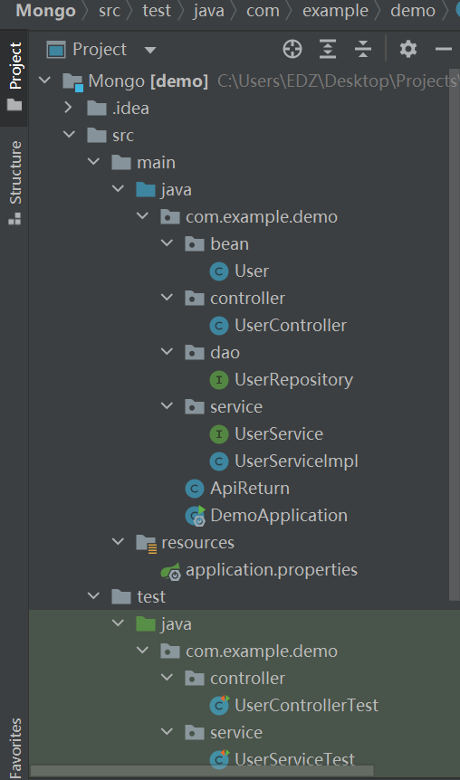
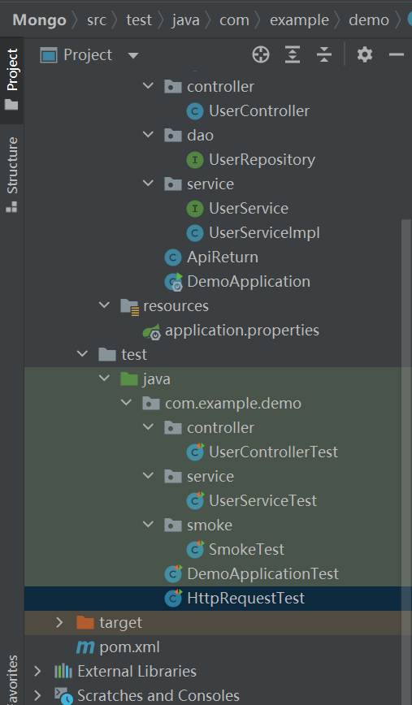

# Mock单元测试

## 前言

之前在做有关Mongo的程序时提到了单元测试，于是这里就开始记录一下当时是怎么做的。

spring官网有不用mock做的简单的单元测试。我这里也会提及。

我是基于这篇文章里的程序做的测试。https://www.jianshu.com/p/24faa1fbe7ca

我用的是java1.8。


## 单元测试

检查方法是否可行，以快速锁定bug源头。

使用SpringBoot写程序时，会分成不同的层级，有Service层、Controller层等等。我们希望在debug时能定位到是那一层出的问题，我们就要一层一层地做单元测试。


## Mock介绍

参考：https://www.jianshu.com/p/94e5de3f28c9

## 1. Mock测试介绍

- **定义**
   在单元测试过程中，对于某些不容易构造或者不容易获取的对象，用一个虚拟对象来创建以便测试的方法。
- 为什么使用mock测试
  - 避免模块开发之间的耦合；
  - 轻量、简便、灵活；

## 2. MockMVC介绍

基于RESTful风格的SpringMVC单元测试，可以测试完整的SpringMVC流程，即从URL请求到控制处理器，带到视图渲染都可以测试。

### 2.1 MockMvc

- 服务器端SpringMVC测试的主入口点。
- 通过MockMVCBuilders建造者的静态方法去建造MockMVCBuilder，MockMvc由MockMVCBuilder构造。
- 核心方法：**perform**(RequestBuilder rb)，执行一个RequestBuilder请，会自动执行SpringMVC的流程并映射到相应的控制器执行处理，该方法的返回值是一个ResultActions。


## 文件结构





其中，冒烟测试（SmokeTest）还没通过。

之前的代码在Springboot Mongo CRUD .md。


## 依赖

```java
<!-- https://mvnrepository.com/artifact/org.mockito/mockito-core -->
<dependency>
    <groupId>org.mockito</groupId>
    <artifactId>mockito-core</artifactId>
    <version>2.23.4</version>
    <scope>compile</scope>
</dependency>
```


## UserControllerTest

单元测试这一层，需要把Mvc给mock一下。

```java
@RunWith(SpringRunner.class)
@SpringBootTest
@AutoConfigureMockMvc
public class UserControllerTest {

    @Autowired
    private WebApplicationContext webApplicationContext;

    @Autowired
    private MockMvc mockMvc;

    @Test
    public void getUserByName() throws Exception {
        this.mockMvc.perform(get("/test/getUserByName?name=Jerry&collectionName=user")).andDo(print()).andExpect(status().isOk());
    }

    @Test
    public void saveUser() throws Exception {
        Map<String, String> map = new HashMap<>();
        map.put("id", "123");
        map.put("name", "tom");
        map.put("password", "tom");
        String content = JSONObject.toJSONString(map);

        this.mockMvc.perform(post("/test/saveUser").contentType(MediaType.APPLICATION_JSON).content(content))
                .andDo(print()).andExpect(status().isOk());
    }

    @Test
    public void updateUser() throws Exception {
        Map<String, String> map = new HashMap<>();
        map.put("id", "123");
        map.put("name", "tom");
        map.put("password", "jerry");
        String content = JSONObject.toJSONString(map);

        this.mockMvc.perform(put("/test/updatePasswordByName").contentType(MediaType.APPLICATION_JSON).content(content))
                .andDo(print()).andExpect(status().isOk());
    }

    @Test
    public void removeUserByName() throws Exception {
        Map<String, String> map = new HashMap<>();
        map.put("id", "123");
        map.put("name", "tom");
        map.put("password", "jerry");
        String content = JSONObject.toJSONString(map);

        this.mockMvc.perform(delete("/test/removeUserByName")
                        .param("name","Jerry")
                        .param("collectionName","user"))
                .andDo(print()).andExpect(status().isOk());
    }


}
```

```java
package com.example.demo.controller;

import com.alibaba.fastjson.JSONObject;
import org.junit.Test;
import org.junit.runner.RunWith;
import org.springframework.beans.factory.annotation.Autowired;
import org.springframework.boot.test.autoconfigure.web.servlet.AutoConfigureMockMvc;
import org.springframework.boot.test.context.SpringBootTest;
import org.springframework.http.MediaType;
import org.springframework.test.context.junit4.SpringRunner;
import org.springframework.test.web.servlet.MockMvc;

import static org.springframework.test.web.servlet.request.MockMvcRequestBuilders.*;
import static org.springframework.test.web.servlet.result.MockMvcResultMatchers.status;

import java.util.HashMap;
import java.util.Map;

import static org.springframework.test.web.servlet.result.MockMvcResultHandlers.print;

@RunWith(SpringRunner.class)
@SpringBootTest
@AutoConfigureMockMvc
public class UserControllerTest {

    @Autowired
    private MockMvc mockMvc;

    @Test
    public void getUserByName() throws Exception {
        this.mockMvc.perform(get("/test/getUserByName?name=Jerry&collectionName=user")).andDo(print()).andExpect(status().isOk());
    }

    @Test
    public void saveUser() throws Exception {
        Map<String, String> map = new HashMap<>();
        map.put("id", "123");
        map.put("name", "tom");
        map.put("password", "tom");
        String content = JSONObject.toJSONString(map);

        this.mockMvc.perform(post("/test/saveUser").contentType(MediaType.APPLICATION_JSON).content(content))
                .andDo(print()).andExpect(status().isOk());
    }

    @Test
    public void updateUser() throws Exception {
        Map<String, String> map = new HashMap<>();
        map.put("id", "123");
        map.put("name", "tom");
        map.put("password", "jerry");
        String content = JSONObject.toJSONString(map);

        this.mockMvc.perform(put("/test/updatePasswordByName").contentType(MediaType.APPLICATION_JSON).content(content))
                .andDo(print()).andExpect(status().isOk());
    }

    @Test
    public void removeUserByName() throws Exception {
        Map<String, String> map = new HashMap<>();
        map.put("id", "123");
        map.put("name", "tom");
        map.put("password", "jerry");
        String content = JSONObject.toJSONString(map);

        this.mockMvc.perform(delete("/test/removeUserByName")
                        .param("name","Jerry")
                        .param("collectionName","user"))
                .andDo(print()).andExpect(status().isOk());
    }


}
```

RunWith:

When a class is annotated with @RunWith or extends a class annotated with @RunWith, JUnit will invoke the class it references to run the tests in that class instead of the runner built into JUnit. We added this feature late in development. While it seems powerful we expect the runner API to change as we learn how people really use it. Some of the classes that are currently internal will likely be refined and become public. 


AutoConfigureMockMvc:

Annotation that can be applied to a test class to enable and configure auto-configuration of MockMvc.


MockMvc:

Main entry point for server-side Spring MVC test support.


perform:

Perform a request and return a type that allows chaining further actions, such as asserting expectations, on the result.


## UserServiceTest

单元测试这一层，需要把Dao层或者Mapper层mock一下。我这里是mock了Dao层的Repository。

```java
package com.example.demo.service;

import com.example.demo.bean.User;
import com.example.demo.dao.UserRepository;
import org.junit.Before;
import org.junit.Test;
import org.junit.jupiter.api.TestInfo;
import org.junit.runner.RunWith;
import org.mockito.MockitoAnnotations;
import org.springframework.boot.test.context.SpringBootTest;
import org.springframework.boot.test.mock.mockito.MockBean;
import org.springframework.test.context.junit4.SpringRunner;

import java.util.ArrayList;
import java.util.List;

import static org.junit.Assert.assertEquals;
import static org.mockito.Mockito.when;

@SpringBootTest
@RunWith(SpringRunner.class)
public class UserServiceTest {
    @MockBean
    UserRepository userRepository;

    @Test
    public void getByUserName(){

        User user = new User();
        user.setId(29);
        user.setName("牛牛");
        user.setPassword("12345678");

        when(userRepository.save(user)).thenReturn(user);

        User list = userRepository.save(user);

        assertEquals("牛牛",list.getName());

    }
}
```

assertEquals:

Asserts that two objects are equal. If they are not, an AssertionError without a message is thrown. If expected and actual are null, they are considered equal.


之后是spring官网给的测试

## DemoApplicationTest

```java
package com.example.demo;

import static org.hamcrest.Matchers.containsString;
import static org.springframework.test.web.servlet.request.MockMvcRequestBuilders.get;
import static org.springframework.test.web.servlet.result.MockMvcResultHandlers.print;
import static org.springframework.test.web.servlet.result.MockMvcResultMatchers.content;
import static org.springframework.test.web.servlet.result.MockMvcResultMatchers.status;

import org.junit.jupiter.api.Test;

import org.springframework.beans.factory.annotation.Autowired;
import org.springframework.boot.test.autoconfigure.web.servlet.AutoConfigureMockMvc;
import org.springframework.boot.test.context.SpringBootTest;
import org.springframework.test.web.servlet.MockMvc;

@SpringBootTest
@AutoConfigureMockMvc
public class DemoApplicationTest {
    @Autowired
    private MockMvc mockMvc;

    @Test
    public void shouldReturnDefaultMessage() throws Exception {
        this.mockMvc.perform(get("/test/greeting")).andDo(print()).andExpect(status().isOk());
    }
}
```


## HttpRequestTest

```java
package com.example.demo;

import org.junit.jupiter.api.Test;

import org.springframework.beans.factory.annotation.Autowired;
import org.springframework.boot.test.context.SpringBootTest;
import org.springframework.boot.test.context.SpringBootTest.WebEnvironment;
import org.springframework.boot.test.web.client.TestRestTemplate;
import org.springframework.boot.web.server.LocalServerPort;

import static org.assertj.core.api.Assertions.assertThat;

@SpringBootTest(webEnvironment = WebEnvironment.RANDOM_PORT)
public class HttpRequestTest {

    @LocalServerPort
    private int port;

    @Autowired
    private TestRestTemplate restTemplate;

    @Test
    public void greetingShouldReturnDefaultMessage() throws Exception {
        assertThat(this.restTemplate.getForObject("http://localhost:" + port + "/test/greeting",
                String.class)).contains("Hello, World");
    }
}
```

LocalServerPort:

Annotation at the field or method/constructor parameter level that injects the HTTP port that got allocated at runtime. Provides a convenient alternative for @Value("${local.server.port}").


相应的Controller层的代码

```java
@RestController
@RequestMapping("/test")
public class UserController {
    @Resource
    private UserService userService;

    @RequestMapping("/greeting")
    public @ResponseBody String greeting() {
        return "Hello, World";
    }
}
```

