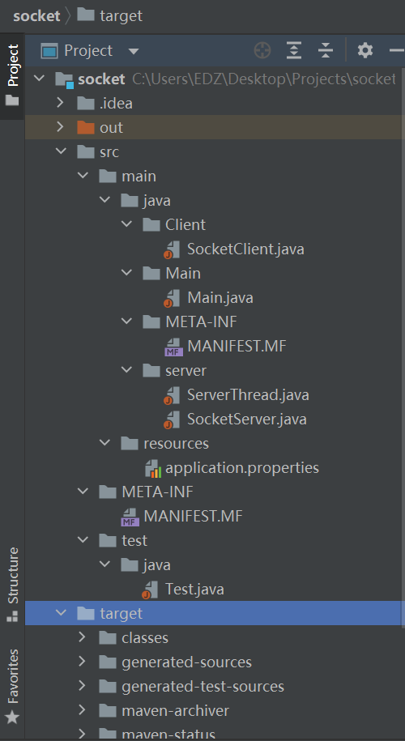
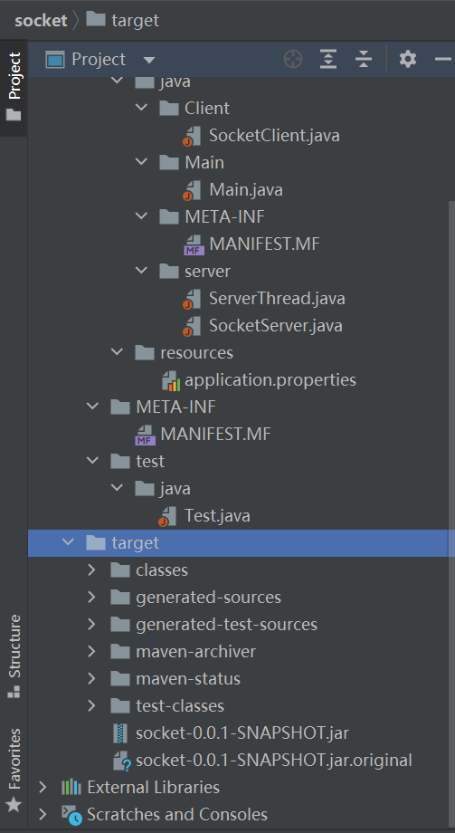

# 用socket建立服务端与客户端，把服务端放到公司ip上，客户端在本地与之信息交互。

## socket构造服务端和客户端，完成数据通信与端的退出

我很快找到了能满足要求并能大概看懂的代码。代码如下。

https://blog.csdn.net/u014209205/article/details/80461122?ops_request_misc=%257B%2522request%255Fid%2522%253A%2522162696418316780255275715%2522%252C%2522scm%2522%253A%252220140713.130102334..%2522%257D&request_id=162696418316780255275715&biz_id=0&utm_medium=distribute.pc_search_result.none-task-blog-2~all~sobaiduend~default-1-80461122.first_rank_v2_pc_rank_v29&utm_term=java+socket&spm=1018.2226.3001.4187

**socket与带service层的spring程序的区别**

之前做的都是http协议上的，是服务层，要写接口
socket走tcp协议，更加原始，不用接口


先运行server,让服务端先跑着，再运行客户端，客户端自己关闭，完成信息交互，可以再日志上查看。

现在要求服务器在公司ip上运行。

但是两者都要启动类。网站上没找到socket的启动类，因为他只实现了在本地能触及的ip地址上构建服务端和客户端。

所以我现在大概的思路是在此基础上写启动类，方便我线上运行。

用socket建立服务端与客户端，把服务端放到公司ip上，客户端在本地与之信息交互。

这就需要把jar包在公司ip上部署时，只让服务端运行。于是我在网上找到了相应的只启动特定类的方法。具体方法在链接里，亲测有效。

https://blog.csdn.net/qq_36929361/article/details/107411199?ops_request_misc=&request_id=&biz_id=102&utm_term=java%E5%90%AF%E5%8A%A8%E7%89%B9%E5%AE%9A%E7%B1%BB&utm_medium=distribute.pc_search_result.none-task-blog-2~all~sobaiduweb~default-1-.first_rank_v2_pc_rank_v29&spm=1018.2226.3001.4187


## 文件结构（好像有点不对）






## 我的代码

SocketClient

```java
package Client;

import java.io.*;
import java.net.Socket;

public class SocketClient {

    public static void main(String[] args) {

        try {
            // 和公司服务器创建连接
            Socket socket = new Socket("192.168.4.31", 18003);

            // 要发送给服务器的信息
            OutputStream os = socket.getOutputStream();
            PrintWriter pw = new PrintWriter(os);
            pw.write("客户端发送信息");
            pw.flush();

            socket.shutdownOutput();

            // 从服务器接收的信息
            InputStream is = socket.getInputStream();
            BufferedReader br = new BufferedReader(new InputStreamReader(is));
            String info = null;
            while ((info = br.readLine()) != null) {
                System.out.println("我是客户端，服务器返回信息：" + info);
            }

            br.close();
            is.close();
            os.close();
            pw.close();
            socket.close();
        } catch (Exception e) {
            e.printStackTrace();
        }
    }

}
```


SocketServer

```java
package server;


import java.net.InetAddress;
import java.net.InetSocketAddress;
import java.net.ServerSocket;
import java.net.Socket;

public class SocketServer {

    public static void main(String[] args) {

        try {
            // 创建服务端socket
            ServerSocket serverSocket = new ServerSocket(18003);

//            serverSocket.bind(new InetSocketAddress("192.168.4.31", 18003));

            // 创建客户端socket
            Socket socket = new Socket();

            //循环监听等待客户端的连接
            while (true) {
                // 监听客户端
                socket = serverSocket.accept();

                ServerThread thread = new ServerThread(socket);
                thread.start();

                InetAddress address = socket.getInetAddress();//返回InetAddress对象包含远程计算机的IP地址。
                System.out.println("当前客户端的IP：" + address.getHostAddress());//返回String对象与该地址的文本表示。
            }
        } catch (Exception e) {
            // TODO: handle exception
            e.printStackTrace();
        }

    }
}
```


ServerThread

```java
package server;

import java.io.*;
import java.net.Socket;

public class ServerThread extends Thread{

    private Socket socket = null;

    public ServerThread(Socket socket) {
        this.socket = socket;
    }

    @Override
    public void run() {
        InputStream is=null;
        InputStreamReader isr=null;
        BufferedReader br=null;
        OutputStream os=null;
        PrintWriter pw=null;
        try {
            is = socket.getInputStream();//客户端给服务端的数据流
            isr = new InputStreamReader(is);
            br = new BufferedReader(isr);

            String info = null;

            while((info=br.readLine())!=null){
                System.out.println("我是服务器，客户端说："+info);
            }
//            socket.shutdownInput();

            os = socket.getOutputStream();
            pw = new PrintWriter(os);
            pw.write("服务器欢迎你");

            pw.flush();
        } catch (Exception e) {
            // TODO: handle exception
        } finally{
            //关闭资源
            try {
                if(pw!=null)
                    pw.close();
                if(os!=null)
                    os.close();
                if(br!=null)
                    br.close();
                if(isr!=null)
                    isr.close();
                if(is!=null)
                    is.close();
                if(socket!=null)
                    socket.close();
            } catch (IOException e) {
                e.printStackTrace();
            }
        }
    }

}
```


注意，这里server吧信息交互扔给了thread类，自己只负责socket生成，持续等待接收消息和socket关闭。这样的好处如果有客服端的请求不能实现，不会造成阻塞。

有关于线程与进程，我们大学是不教的。请点击链接了解一下。

https://blog.csdn.net/chao2263263364/article/details/44649569?ops_request_misc=%257B%2522request%255Fid%2522%253A%2522162705004816780265457118%2522%252C%2522scm%2522%253A%252220140713.130102334..%2522%257D&request_id=162705004816780265457118&biz_id=0&utm_medium=distribute.pc_search_result.none-task-blog-2~all~sobaiduend~default-1-44649569.first_rank_v2_pc_rank_v29&utm_term=socket+thread&spm=1018.2226.3001.4187

值得注意的是，我的这种事集成thread类实现多线程；还可以用runnable接口。例子还在链接里。

https://blog.csdn.net/fexeng/article/details/51137505?ops_request_misc=%257B%2522request%255Fid%2522%253A%2522162705004816780265457118%2522%252C%2522scm%2522%253A%252220140713.130102334..%2522%257D&request_id=162705004816780265457118&biz_id=0&utm_medium=distribute.pc_search_result.none-task-blog-2~all~sobaiduend~default-2-51137505.first_rank_v2_pc_rank_v29&utm_term=socket+thread&spm=1018.2226.3001.4187


在信息交互时，发现在本地的客户端能收到信息，而服务端不行。看了代码，两边都是通过System.out.print输出，所以不是socket的问题。

刚开始还以为是缓存的问题，但是发现有flush()。后来，在命令提示符中退出服务端进程后，发现日志，也就是客户端发的信息才显示出来。

然后，我试着在运行jar包时，把日志打印在log文件里。在运行时，看日志，发现是成功的。所以是命令提示符这个界面不显示日志罢了。垃圾玩意儿。

师父教我用Xshell，完美解决。


