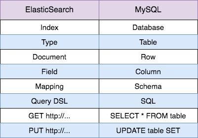
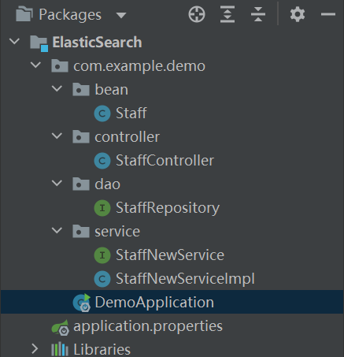

# Springboot Elasticsearch CRUD+


elasticSearch官网是比任何其他博客都正规的学习平台

https://www.elastic.co/cn/elasticsearch/

教学地址

https://www.elastic.co/guide/en/elasticsearch/reference/current/getting-started.html


与mysql区别




我的项目是下载了elastic，本地运行自己玩

https://blog.csdn.net/aabbyyz/article/details/83722462?ops_request_misc=%257B%2522request%255Fid%2522%253A%2522162806535316780269891791%2522%252C%2522scm%2522%253A%252220140713.130102334..%2522%257D&request_id=162806535316780269891791&biz_id=0&utm_medium=distribute.pc_search_result.none-task-blog-2~all~sobaiduend~default-1-83722462.first_rank_v2_pc_rank_v29&utm_term=elasticsearch%E4%B8%8B%E8%BD%BD&spm=1018.2226.3001.4187


## 文件结构



## pom.xml

```java
<?xml version="1.0" encoding="UTF-8"?>
<project xmlns="http://maven.apache.org/POM/4.0.0" xmlns:xsi="http://www.w3.org/2001/XMLSchema-instance"
         xsi:schemaLocation="http://maven.apache.org/POM/4.0.0 https://maven.apache.org/xsd/maven-4.0.0.xsd">
    <modelVersion>4.0.0</modelVersion>
    <parent>
        <groupId>org.springframework.boot</groupId>
        <artifactId>spring-boot-starter-parent</artifactId>
        <version>2.5.2</version>
        <relativePath/> <!-- lookup parent from repository -->
    </parent>
    <groupId>com.vue</groupId>
    <artifactId>ElasticSearch</artifactId>
    <version>0.0.1-SNAPSHOT</version>
    <name>ElasticSearch</name>
    <description>ElasticSearch</description>

    <properties>
        <java.version>1.8</java.version>
    </properties>

    <dependencies>
        <dependency>
            <groupId>org.springframework.boot</groupId>
            <artifactId>spring-boot-starter-web</artifactId>
        </dependency>
        <dependency>
            <groupId>org.projectlombok</groupId>
            <artifactId>lombok</artifactId>
            <version>1.16.20</version>
        </dependency>

        <!-- https://mvnrepository.com/artifact/org.springframework.boot/spring-boot-starter-data-elasticsearch -->
        <dependency>
            <groupId>org.springframework.boot</groupId>
            <artifactId>spring-boot-starter-data-elasticsearch</artifactId>
        </dependency>

    </dependencies>

    <build>
        <plugins>
            <plugin>
                <groupId>org.springframework.boot</groupId>
                <artifactId>spring-boot-maven-plugin</artifactId>
                <version>2.5.2</version>
                <configuration>
                    <mainClass>com.example.demo.DemoApplication</mainClass>
                </configuration>
            </plugin>
        </plugins>
    </build>

</project>
```


## application.properties

```java
# ES
spring.data.elasticsearch.repositories.enabled = true
spring.data.elasticsearch.cluster-nodes = 127.0.0.1:9200
```


## Staff

```java
@Document(indexName = "department")
public class Staff {
    @Id
    private String id;
    @Field
    private String firstName;
    @Field
    private String lastName;
    @Field
    private Integer age = 0;
    @Field
    private String about;

    public String getId() {
        return id;
    }

    public void setId(String id) {
        this.id = id;
    }

    public String getFirstName() {
        return firstName;
    }

    public void setFirstName(String firstName) {
        this.firstName = firstName;
    }

    public String getLastName() {
        return lastName;
    }

    public void setLastName(String lastName) {
        this.lastName = lastName;
    }

    public Integer getAge() {
        return age;
    }

    public void setAge(Integer age) {
        this.age = age;
    }

    public String getAbout() {
        return about;
    }

    public void setAbout(String about) {
        this.about = about;
    }
}
```

[^@Document(indexName = &quot;department&quot;)]: index名，文件名设置为department


## StaffController

```java
@RestController
@RequestMapping("/elasticSearch")
public class StaffController {

    @Autowired
    private StaffNewService staffNewService;

    @ResponseBody
    @GetMapping("/saveStaff")
    public String saveStaff(@RequestBody Staff staff){
        staffNewService.saveStaff(staff);
        return "saved";
    }

    @ResponseBody
    @RequestMapping("/deleteStaff")
    public String deleteStaff(@RequestParam String id){
        staffNewService.deleteStaff(id);
        return "deleted";
    }

    @ResponseBody
    @RequestMapping("/updateStaff")
    public String updateStaff(@RequestParam String id,@RequestParam String firstName){
        staffNewService.updateStaff(id,firstName);
        return "updated";
    }

    //以下都是按照firstName搜索

    @ResponseBody
    @RequestMapping("/matchAllQuery")//搜索该field（索引）内全部信息
    public String matchAllQuery(@RequestParam String field) throws IOException {
        SearchResponse searchResponse = staffNewService.matchAllQuery(field);
        return "matchAllQuery" + searchResponse;
    }

    @ResponseBody
    @RequestMapping("/regexpQuery")//以一句话里的单词为关键字查询该句话，不能以一个单词里的几个字母作为关键字搜索该词。这就和mongo里的regex不一样，它能做后者。
    public String regexpQuery(@RequestParam String field,@RequestParam String keyword) throws IOException {
        SearchResponse searchResponse = staffNewService.regexpQuery(field,keyword);
        return "regexpQuery" + searchResponse;
    }

    @ResponseBody
    @RequestMapping("/fuzzyQuery")//首先，他会把我正确的keyword全改成小写，两个字符出错
                                    // （漏了，多了，i变j了，只要总数是2以内）就查得出来，多了不行
    public String fuzzyQuery(@RequestParam String field,@RequestParam String keyword) throws IOException {
        SearchResponse searchResponse = staffNewService.fuzzyQuery(field,keyword);
        return "fuzzyQuery" + searchResponse;
    }

    @ResponseBody
    @RequestMapping("/termQuery")//如果正确的没空格，也是先会把我正确的keyword变成小写，再搜索，要完全一样才行
                                    // 如果原来的有空格，搜索第一串字符串才能搜出来（还是小写，即使正确的是大写）
    public String termQuery(@RequestParam String field,@RequestParam String keyword) throws IOException {
        SearchResponse searchResponse = staffNewService.termQuery(field,keyword);
        return "termQuery" + searchResponse;
    }

    @ResponseBody
    @RequestMapping("/matchQuery")//大小写随便,空格不能漏
    public String matchQuery(@RequestParam String field,@RequestParam String keyword) throws IOException {
        SearchResponse searchResponse = staffNewService.matchQuery(field,keyword);
        return "matchQuery" + searchResponse;
    }
}
```


## StaffRepository（基本用不到）

```java
@Component
public interface StaffRepository extends ElasticsearchRepository<Staff,String> {

    /**
     * 根据ID 查询员工信息
     *
     * @param id id
     * @return Staff
     */
    Staff queryStaffById(String id);

}
```

ElasticsearchRepository:

```java
@NoRepositoryBean
public interface ElasticsearchRepository<T, ID> extends PagingAndSortingRepository<T, ID> {

   /**
    * Search for similar entities using a morelikethis query
    * 
    * @param entity the entity for which similar documents should be searched, must not be {@literal null}
    * @param fields
    * @param pageable , must not be {@literal null}
    * @return
    */
   Page<T> searchSimilar(T entity, @Nullable String[] fields, Pageable pageable);
}
```

PagingAndSortingRepository:

Extension of CrudRepository to provide additional methods to retrieve entities using the pagination and sorting abstraction.

CrudRepository:

Interface for generic CRUD operations on a repository for a specific type.


## StaffNewService

```java
@Service
@Component
public interface StaffNewService {


    /**
     * 新增员工测试
     *
     * @return String
     */
    public void saveStaff(Staff staff) ;

    /**
     * 删除测试
     *
     * @return
     */
    public void deleteStaff(String id) ;

    /**
     * 更新
     * @return
     */
    public void updateStaff(String id,String firstName) ;
    /**
     * 查询
     * @return
     */
    public void queryStaff(String id) ;

    public SearchResponse matchAllQuery(String field) throws IOException;

    public SearchResponse regexpQuery(String field, String keyword) throws IOException;

    public SearchResponse fuzzyQuery(String field, String keyword) throws IOException;

    public SearchResponse termQuery(String field, String keyword) throws IOException;

    public SearchResponse matchQuery( String field, String keyword) throws IOException;

}
```


## StaffNewServiceImpl

```java
@Service
@Component
public class StaffNewServiceImpl implements StaffNewService {

    @Autowired
    private StaffRepository staffRepository;

    @Resource
    private ElasticsearchRestTemplate elasticsearchRestTemplate;

    /**
     * 新增员工测试
     *
     * @return String
     */
    public void saveStaff(Staff staff) {
        staffRepository.save(staff);
    }

    /**
     * 删除测试
     *
     * @return
     */
    public void deleteStaff(String id) {
        Staff staff = staffRepository.queryStaffById(id);
        staffRepository.delete(staff);
    }

    /**
     * 更新
     * @return
     */
    public void updateStaff(String id,String firstName) {
        Staff staff = staffRepository.queryStaffById(id);
        staff.setFirstName(firstName);
        staffRepository.save(staff);
    }
    /**
     * 查询
     * @return
     */
    public void queryStaff(String id) {
        Staff staff = staffRepository.queryStaffById("1");
    }

    public SearchResponse matchAllQuery(String field) throws IOException{
        RestHighLevelClient client = new RestHighLevelClient(RestClient.builder(
                new HttpHost("127.0.0.1", 9200, "http")));

        SearchSourceBuilder searchSourceBuilder = new SearchSourceBuilder();
        searchSourceBuilder.query(QueryBuilders.matchAllQuery());

        SearchRequest searchRequest = new SearchRequest();
        searchRequest.indices(field);
        searchRequest.source(searchSourceBuilder);
        SearchResponse searchResponse = client.search(searchRequest, RequestOptions.DEFAULT);
        return searchResponse;
    }
    /**
     *  带分页、权重、分域查询
     * @param field 索引
     * @param keyword 关键字
     * @return staff集合
     */
    public SearchResponse regexpQuery(String field, String keyword) throws IOException{
        RestHighLevelClient client = new RestHighLevelClient(RestClient.builder(
                new HttpHost("127.0.0.1", 9200, "http")));

        SearchSourceBuilder searchSourceBuilder = new SearchSourceBuilder();
        searchSourceBuilder.query(QueryBuilders.regexpQuery("firstName",keyword));

        SearchRequest searchRequest = new SearchRequest();
        searchRequest.indices(field);
        searchRequest.source(searchSourceBuilder);
        SearchResponse searchResponse = client.search(searchRequest, RequestOptions.DEFAULT);
        return searchResponse;
    }

    public SearchResponse fuzzyQuery(String field, String keyword) throws IOException{
        RestHighLevelClient client = new RestHighLevelClient(RestClient.builder(
                new HttpHost("127.0.0.1", 9200, "http")));

        SearchSourceBuilder searchSourceBuilder = new SearchSourceBuilder();
        searchSourceBuilder.query(QueryBuilders.fuzzyQuery("firstName",keyword));

        SearchRequest searchRequest = new SearchRequest();
        searchRequest.indices(field);
        searchRequest.source(searchSourceBuilder);
        SearchResponse searchResponse = client.search(searchRequest, RequestOptions.DEFAULT);
        return searchResponse;
    }

    public SearchResponse termQuery(String field, String keyword) throws IOException{
        RestHighLevelClient client = new RestHighLevelClient(RestClient.builder(
                new HttpHost("127.0.0.1", 9200, "http")));

        SearchSourceBuilder searchSourceBuilder = new SearchSourceBuilder();
        searchSourceBuilder.query(QueryBuilders.termQuery("firstName",keyword));

        SearchRequest searchRequest = new SearchRequest();
        searchRequest.indices(field);
        searchRequest.source(searchSourceBuilder);
        SearchResponse searchResponse = client.search(searchRequest, RequestOptions.DEFAULT);
        return searchResponse;
    }

    public SearchResponse matchQuery( String field, String keyword) throws IOException{
        RestHighLevelClient client = new RestHighLevelClient(RestClient.builder(
                new HttpHost("127.0.0.1", 9200, "http")));

        SearchSourceBuilder searchSourceBuilder = new SearchSourceBuilder();
        searchSourceBuilder.query(QueryBuilders.matchQuery("firstName",keyword));

        SearchRequest searchRequest = new SearchRequest();
        searchRequest.indices(field);
        searchRequest.source(searchSourceBuilder);
        SearchResponse searchResponse = client.search(searchRequest, RequestOptions.DEFAULT);
        return searchResponse;
    }

}
```

[^HttpHost]: 程序里生成客户端，这样不需要加什么插件就能读取elastic里的索引，文件了。

SearchSourceBuilder:

A search source builder allowing to easily build search source. Simple construction using searchSource().

fuzzyQuery:

A Query that matches documents using fuzzy query.
Params:
name – The name of the field
value – The value of the term

SerchRequest:

A request to execute search against one or more indices (or all). Best created using org.elasticsearch.client.Requests.searchRequest(String...).

SearchResponse:

A response of a search request.

RestHighLevelClient:

High level REST client that wraps an instance of the low level RestClient and allows to build requests and read responses. The RestClient instance is internally built based on the provided RestClientBuilder and it gets closed automatically when closing the RestHighLevelClient instance that wraps it.


## DemoApplication

```java
@SpringBootApplication
public class DemoApplication {
    public static void main(String[] args){
        SpringApplication.run(DemoApplication.class,args);
    }
}
```


本地程序运行端口默认是8080，所以postman调用接口时的端口时8080。

但是elasticSearch默认是在9200运行的。

**不要搞混！！！**


我就主要玩了一下searchSourceBuilder里的各种query，aggregation好像主要做的是数据统计，这个我没玩。


