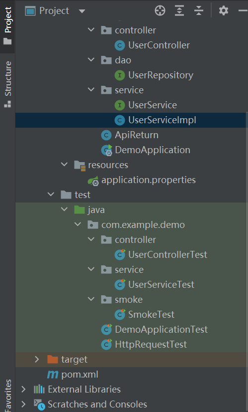

# Springboot-Mongo CRUD+

## 工具

idea

maven

postman

navicat


## 文件结构




Test里的代码是在做单元测试时用的，现在用不着。


## 代码


### pom.xml

```java
<?xml version="1.0" encoding="UTF-8"?>
<project xmlns="http://maven.apache.org/POM/4.0.0" xmlns:xsi="http://www.w3.org/2001/XMLSchema-instance"
         xsi:schemaLocation="http://maven.apache.org/POM/4.0.0 https://maven.apache.org/xsd/maven-4.0.0.xsd">
    <modelVersion>4.0.0</modelVersion>
    <parent>
        <groupId>org.springframework.boot</groupId>
        <artifactId>spring-boot-starter-parent</artifactId>
        <version>2.5.2</version>
        <relativePath/> <!-- lookup parent from repository -->
    </parent>
    <groupId>com.vue</groupId>
    <artifactId>demo</artifactId>
    <version>0.0.1-SNAPSHOT</version>
    <name>demo</name>
    <description>Demo project for Spring Boot</description>

    <properties>
        <java.version>1.8</java.version>
    </properties>

    <dependencies>
        <dependency>
            <groupId>org.springframework.boot</groupId>
            <artifactId>spring-boot-starter-web</artifactId>
        </dependency>
        <dependency>
            <groupId>org.projectlombok</groupId>
            <artifactId>lombok</artifactId>
            <version>1.16.20</version>
        </dependency>

        <!-- https://mvnrepository.com/artifact/org.springframework.boot/spring-boot-starter-data-mongodb -->
        <dependency>
            <groupId>org.springframework.boot</groupId>
            <artifactId>spring-boot-starter-data-mongodb</artifactId>
        </dependency>
        <!-- https://mvnrepository.com/artifact/org.mockito/mockito-core -->
        <dependency>
            <groupId>org.mockito</groupId>
            <artifactId>mockito-core</artifactId>
            <version>2.23.4</version>
            <scope>compile</scope>
        </dependency>

        <dependency>
            <groupId>org.junit.jupiter</groupId>
            <artifactId>junit-jupiter-api</artifactId>
            <version>5.3.2</version>
            <scope>compile</scope>
        </dependency>

    </dependencies>

    <build>
        <plugins>
            <plugin>
                <groupId>org.springframework.boot</groupId>
                <artifactId>spring-boot-maven-plugin</artifactId>
                <configuration>
                    <mainClass>com.example.demo.DemoApplication</mainClass>
                </configuration>

            </plugin>
        </plugins>
    </build>

</project>
```


### application.properties

```java
server.port=8888
spring.data.mongodb.database=test
spring.data.mongodb.host=localhost
spring.data.mongodb.port=27017
```


### User

```java
public class User {
    private int id;
    private String name;
    private String password;

    public int getId() {
        return id;
    }

    public void setId(int id) {
        this.id = id;
    }

    public String getName() {
        return name;
    }

    public void setName(String name) {
        this.name = name;
    }

    public String getPassword() {
        return password;
    }

    public void setPassword(String password) {
        this.password = password;
    }
}
```


### UserRepository

```java
public interface UserRepository extends MongoRepository<User,Integer> {
    User getByName(String name);
}
```

MongoRepository:

Mongo specific org.springframework.data.repository.Repository interface.

PagingAndSortingRepository:

Extension of CrudRepository to provide additional methods to retrieve entities using the pagination and sorting abstraction.

CrudRepository :

Interface for generic CRUD operations on a repository for a specific type.

QueryByExampleExecutor:

Interface to allow execution of Query by Example Example instances.


### UserService

```java
public interface UserService {
    public void saveUser(User user);
    public void removeUserByUserName(String name,String collectionName);
    public void updatePasswordByName(User user);
    public List<User> getByUserName(String name,String collectionName);
    public List<User> getByUserNameLike(String name, String collectionName);
    public void getByUserPage();
    public List<User> selectByRegex(String name,String collectionName);
    public long countByName(String name,String collectionName);
    public List<User> selectByAggregation(String name,String collectionName);
    public List<User> selectByNameSort(String name,String collectionName);
    public List<User> selectByCompare(String password,String collectionName);
    public List<User> selectByAnd(String name,String password,String collectionName);
    public List<User> selectByIn(String name,List<String> names,String collectionName);
    public List<User> selectByPage(String name,String collectionName,int page,int size);
}
```


### UserServiceImpl

```java
@Service
public class UserServiceImpl implements UserService{
    @Resource
    private MongoTemplate mongoTemplate;
    @Resource
    private UserRepository userRepository;
    @Override
    public void saveUser(User user){
        userRepository.save(user);
    }
    @Override
    public void removeUserByUserName(String name,String collectionName){
        Query query = new Query(new Criteria("name").is(name));//
        mongoTemplate.remove(query,collectionName);
    }

    @Override
    public void updatePasswordByName(User user){
        Query query = new Query(new Criteria("name").is(user.getName()));//new Criteria("id").is(user.getId())
        Update update = new Update().set("password",user.getPassword());
        mongoTemplate.updateMulti(query,update,User.class);
    }

    @Override
    public List<User> getByUserName(String name,String collectionName){
        Query query = Query.query(Criteria.where("name").is(name));
        List<User> result = mongoTemplate.find(query, User.class, collectionName);
        return result;
    }

    @Override
    public List<User> getByUserNameLike(String name,String collectionName){
        Query query = Query.query(Criteria.where("name").all(Arrays.asList(name)));
        List<User> result = mongoTemplate.find(query, User.class,collectionName);
        //满足所有条件的数据
        return result;
    }


    @Override
    public void getByUserPage(){

    }

    @Override
    public List<User> selectByRegex(String name,String collectionName){
        Query query = new Query(Criteria.where("name").regex(name));
        List<User> result = mongoTemplate.find(query, User.class,collectionName);
        return result;
    }

    @Override
    public long countByName(String name,String collectionName){
        Query query = new Query(Criteria.where("name").is(name));
        long num = mongoTemplate.count(query,collectionName);
        return num;
    }

    @Override//聚合的先后顺序很重要
    public List<User> selectByAggregation(String name,String collectionName) {
        Aggregation aggregation = Aggregation.newAggregation(
                Aggregation.match(Criteria.where("name").is(name)),
                Aggregation.limit(3),
                Aggregation.skip(1l),
                Aggregation.sort(Sort.Direction.DESC,"password"),//不能以id降序
                Aggregation.limit(3)
//                ,Aggregation.group("name").count().as("userName")
        );
        AggregationResults<User> result = mongoTemplate.aggregate(aggregation,collectionName, User.class);
        return result.getMappedResults();
    }

    @Override
    public List<User> selectByNameSort(String name,String collectionName) {
        Query query = new Query();
        query = Query.query(Criteria.where("name").is(name));
        List<User> list = mongoTemplate.find(query, User.class, collectionName);
        return list;
    }

    @Override
    public List<User> selectByCompare(String password,String collectionName){
        Query query = Query.query(Criteria.where("password").gte(password));
        List<User> list = mongoTemplate.find(query, User.class,collectionName);
        return list;
    }

    @Override
    public List<User> selectByAnd(String name,String password,String collectionName){
        Query query = Query.query(Criteria.where("name").is(name).and("password").is(password));
        List<User> list = mongoTemplate.find(query, User.class,collectionName);
        return list;
    }

    @Override
    public List<User> selectByIn(String name,List<String> names,String collectionName){
        Query query = Query.query(Criteria.where("name").is(name).in(names));
        List<User> list = mongoTemplate.find(query, User.class,collectionName);
        return list;
    }

    @Override
    public List<User> selectByPage(String name,String collectionName,int page,int size){
        Query query = Query.query(Criteria.where("name").is(name));
        PageRequest pageRequest = PageRequest.of(page,size);
        query.with(pageRequest);
        List<User> list = mongoTemplate.find(query, User.class,collectionName);
        return list;
    }
}
```

Query:

MongoDB Query object representing criteria, projection, sorting and query hints.


MongoTemplate:

Primary implementation of MongoOperations.


MongoOperations:

Interface that specifies a basic set of MongoDB operations. Implemented by MongoTemplate. Not often used but a useful option for extensibility and testability (as it can be easily mocked, stubbed, or be the target of a JDK proxy).


Aggregation://聚合的先后顺序很重要

An Aggregation is a representation of a list of aggregation steps to be performed by the MongoDB Aggregation Framework.


### UserController

```java
@RestController
@RequestMapping("/test")
public class UserController {
    @Resource
    private UserService userService;

    @RequestMapping("/save")
    @ResponseBody    //id被系统默认为主键。如果同一个id save两个不同用户，原来的用户会被取代
    public String saveUser(@RequestBody User user){
        userService.saveUser(user);
        return "插入成功";
    }

    @RequestMapping("/remove")
    @ResponseBody
    public String removeUserByName(@RequestParam String name,@RequestParam String collectionName){
        userService.removeUserByUserName(name,collectionName);
        return "删除成功";
    }

    @RequestMapping("/updatePasswordByName")//把所有名字为指定名字的用户的密码换掉
    @ResponseBody
    public String updatePasswordByName(@RequestBody User user){
        userService.updatePasswordByName(user);
        return "更新成功";
    }

//    @RequestMapping("/getUserByPage")
//    @ResponseBody
//    public User getUserByPage(@RequestParam String name){
//        User user = userService.getByUserName(name);
//        return user;
//    }


    @RequestMapping("/getUserByName")
    @ResponseBody
    public List<User> getByUserName(@RequestParam String name,@RequestParam String collectionName){
        List<User> list = userService.getByUserName(name,collectionName);

        return list;
    }

    @RequestMapping("/getUserByNameLike")
    @ResponseBody
    public List<User> getUserByNameLike(@RequestParam String name,@RequestParam String collectionName){
        List<User> list = userService.getByUserNameLike(name,collectionName);
        return list;
    }

    @RequestMapping("/countByName")
    @ResponseBody
    public long countByName(@RequestParam String name,@RequestParam String collectionName){
        long count = userService.countByName(name,collectionName);
        return count;
    }

    @RequestMapping("/selectByRegex")
    @ResponseBody
    public List<User> selectByRegex(String name,String collectionName){
        List<User> list = userService.selectByRegex(name,collectionName);
        return list;
    }

    @RequestMapping("/selectByAggregation")
    @ResponseBody
    public List<User> selectByAggregation(String name,String collectionName){
        List<User> groupResult = userService.selectByAggregation(name,collectionName);
        return groupResult;
    }

    @RequestMapping("/selectBySort")
    @ResponseBody
    public List<User> selectNameBySort(String name,String collectionName){
        List<User> sortResult = userService.selectByNameSort(name,collectionName);
        return sortResult;
    }

    @RequestMapping("/selectByCompare")
    @ResponseBody
    public List<User> selectByCompare(String password,String collectionName){
        List<User> compareResult = userService.selectByCompare(password,collectionName);
        return compareResult;
    }

    @RequestMapping("/selectByAnd")
    @ResponseBody
    public List<User> selectByAnd(String name,String password,String collectionName){
        List<User> compareResult = userService.selectByAnd(name,password,collectionName);
        return compareResult;
    }

    @RequestMapping("/selectByIn")
    @ResponseBody
    public List<User> selectByOr(@RequestParam String name,@RequestParam List<String> names,@RequestParam String collectionName){
        List<User> compareResult = userService.selectByIn(name,names,collectionName);
        return compareResult;
    }

    @RequestMapping("/selectByPage")
    @ResponseBody
    public List<User> selectByPage(@RequestParam String name,
                                   @RequestParam String collectionName,
                                   @RequestParam int page,//page从0开始算第一页
                                   @RequestParam int size){
        List<User> pageResult = userService.selectByPage(name, collectionName, page, size);
        return pageResult;
    }

}
```