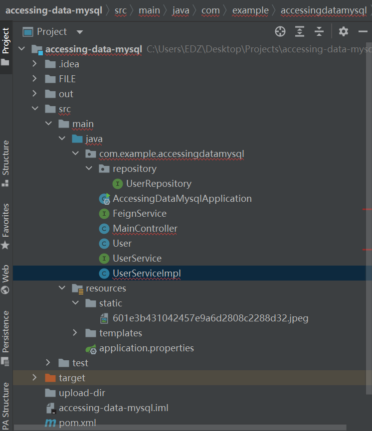

# **Springboot-Mysql-Jdbc CRUD** 

用jdbc访问本地或者服务器上的mysql数据库，进行用户信息的**增删改查**基本操作

##  

## 工具

IDEA

maven（用来自动下载jar包，插件啥的，很方便）

filezilla

springboot

postman

这些版本要求可以参考下面给的网址以及一些网站的资料。

##  

## 流程

### 本地

IDEA:

spring官网上有accessing-data-mysql的指引

https://spring.io/guides/gs/accessing-data-mysql/

按照指引搭建基本框架

你会在本地创建一个db_example的数据库，并在里面放入实体（用户信息）

要实现增删改查，还需要在mainController,Service和ServiceImpl中加入相应的实现代码。其中mC主要存放该操作的实现地址，Service层封装具体操作给客户端，ServiceImpl实现前者。

mC中要有@controller,Service中要有@Service.

由于要在服务器上搭建，所以要在application.context中加入server.port（端口号）并且改spring.datasource.url至该数据库的ip地址。

先在本地运行（ip,username,password,url什么的都要是本地的）,**让程序生成一个进程**。

若没问题，就先访问本地的进程。

##  

## 本地访问

在postman上输入url的地方写本地该进程的url地址，格式如下。

[http://localhost](http://localhost/):**端口号**（默认3306）/**进程目录**（在mC中定义）

##  

## 打包

所有东西做完后，把程序打包成jar文件。（这部分官网上有）。要注意的是在用maven打包时，先点击maven中的reload，然后点击lifecycle中的skip tests，再运行lifecycle中的clean和package(右键，选运行）。这一步是为了打包做铺垫。最后点击**maven中的运行**，打包的jar文件会生成在target目录下。

##  

## 上传

我们希望能在服务器上运行这个进程，所以最后的数据库和进程都要在服务器上，并且能被访问到。

在上传之前，要注意本地运行成功的程序要将dataresourced的ip改成数据库服务器的。我这里的url不一定是进程所在的ip地址。比如我的数据库的ip是我本地的ip地址（cmd下ipconfig),而进程所在的ip是项目集体的。

当然，端口也要对应。server.port中的端口是项目进程服务器的一个端口。我的项目端口上限是65535（大概是）。

找空闲的端口：netstat -anp | grep :待选的端口

如果啥也没显示，就说明这个端口是空的。否则就不是。

username和password大概率不用改。文章开头给的官方文档给的步骤好像本地创建了username:springuser;password:ThePassword 服务器上的大概率不用改。

注意，这里的username和password都是访问数据库用的

这些调整好后，按原来的方式打包jar文件。

在filezilla中登录项目服务器，把jar文件托人指定位置。

##  

## 构建

构建就是在服务器上跑通jar文件。

若你是第一次构建，那请跳过（1）直接继续；否则，你要先看看你原来jar包构建的进程是否还在。

（1）ps auxf|grep 待运行的从filezilla上传的jar包 //查看jar包的进程是否还在

若你能看到一个java什么什么，一个grep什么什么，说明该进程在运行，需要杀死进程。java哪一行会有一串数字，那是该进程的进程号。

kill jar包对应的进程号 //杀死进程

若只看到一个grep什么什么，直接继续。

（2）cmd中输入

ssh -p 22 root@项目的ip地址 //进入项目服务器

输入完密码后进入服务器

cd到指定的文件夹下 //调整到jar包的位置

java -jar 待运行的从filezilla上传的jar包 //上传jar包

若本地运行成功，这里也应该一样。

##  

## 访问

在postman中吧url改成

http://项目ip地址：端口号/目的文件夹（存jar文件的文件夹）

若有参数需要给，则在param中key value中给出参数名与值。

然后调整使用get方法还是post方法或者其他（一般看要报错“method啥的”说明用错方法了）

回车，会给出对应的方法结果（增删改查的结果）

若报错（server error啥的，应该是本身的方法写的有问题）

比如按id查用户时，若该id没用户，你还用get()方法，idea会提示你有问题，最好改成orElse(null时输出的内容)方法。

总之，这个过程很大程度上是请教了我师父做的，他给了我很大的帮助。比如“改”中，save(User)能按照id改用户信息，就是他教的。其余的就是全是细枝末节的bug，但由于这个项目过于简单，所以能犯的错很少，我很多都是因为对于代码具体功能的无知导致的。这里主要记录一下，免得以后忘了。有些地方理解的不是很到位，请各路大神互相交流。


### 构建

构建就是在服务器上跑通jar文件。

若你是第一次构建，那请跳过（1）直接继续；否则，你要先看看你原来jar包构建的进程是否还在。

（1）ps auxf|grep 待运行的从filezilla上传的jar包	//查看jar包的进程是否还在

若你能看到一个java什么什么，一个grep什么什么，说明该进程在运行，需要杀死进程。java哪一行会有一串数字，那是该进程的进程号。

kill jar包对应的进程号	//杀死进程

若只看到一个grep什么什么，直接继续。


（2）cmd中输入 

ssh -p 22 root@项目的ip地址	//进入项目服务器

输入完密码后进入服务器	

cd到指定的文件夹下	//调整到jar包的位置

java -jar 待运行的从filezilla上传的jar包	//上传jar包

若本地运行成功，这里也应该一样。


### 访问

在postman中吧url改成

http://项目ip地址：端口号/目的文件夹（存jar文件的文件夹）

若有参数需要给，则在param中key value中给出参数名与值。

然后调整使用get方法还是post方法或者其他（一般看要报错“method啥的”说明用错方法了）

回车，会给出对应的方法结果（增删改查的结果）

若报错（server error啥的，应该是本身的方法写的有问题）

比如按id查用户时，若该id没用户，你还用get()方法，idea会提示你有问题，最好改成orElse(null时输出的内容)方法。


总之，这个过程很大程度上是请教了我师父做的，他给了我很大的帮助。比如“改”中，save(User)能按照id改用户信息，就是他教的。其余的就是全是细枝末节的bug，但由于这个项目过于简单，所以能犯的错很少，我很多都是因为对于代码具体功能的无知导致的。这里主要记录一下，免得以后忘了。有些地方理解的不是很到位，请各路大神互相交流。


前面写了大体步骤，现在上代码

### 报错：

​    spring-boot-maven-plugin:2.5.2:repackage failed: Unable to find main class

### 改正：

​	有俩个main启动，删掉一个。


要求删的时候postman上要用delete方法；改的时候用body,而不用param，用post方法；增的时候也是用body，用post方法。


## 文件结构



看得出来，虽然当时是完成了，但是到现在这个过程中又发生了些什么。


## 主要内容

### **按id查用户**

```java
//按照id查询用户信息
    @GetMapping(path = "/byId")
    public @ResponseBody
    //请求参数id映射绑定函数参数id,函数参数与数据库参数已在实体通过注解映射绑定
    String getUserById(@RequestParam("id") Integer id) {
        // This returns a JSON or XML with the users
        User = userRepository.getUserById(id);
            if(User != null) {
                return "{\nid:" + userRepository.findById(id).get().getId() + ";\nname:" + userRepository.findById(id).get().getName() + ";\nemail:" + userRepository.findById(id).get().getName() + "\n}";
            }
            else
                return "Your id is wrong.Please dial again!";

    }
```


### **增**

```java
@PostMapping(path="/add") // Map ONLY POST Requests
public @ResponseBody String addNewUser (@RequestBody User newUser) {
    // @ResponseBody means the returned String is the response, not a view name
    // @RequestParam means it is a parameter from the GET or POST request


    userRepository.save(newUser);
    return "Saved";
}
```


### **删**

```java
//按照id删除用户
@DeleteMapping(path = "/deleteById")
public @ResponseBody
String delUser(@RequestParam("id") Integer id) {
    User = userRepository.getUserById(id);
    if(User != null) {
        userRepository.deleteById(id);
        return "deleted";
    }
    else
        return "error";
}
```


### **改**

```java
//通过id对name字段进行更新
@PutMapping( path="/update")
public @ResponseBody
String update(@RequestBody User newUser) {
    //if(id == User.getId();
    if(newUser != null){
        userRepository.save(newUser);
        return "Updated";
    }
    else{
        return "error";
    }
}
```

@RequestBody后面跟类，不想@RequestParam后面跟数据类型

前者在poatman中用Body写json文件，后者在param中key-value中分别写数据名和内容。


userRepository.save(newUser);

save时不仅保存，还会更新。


### **查所有用户**

```java
@GetMapping(path="/all")
public @ResponseBody Iterable<User> getAllUsers() {
    // This returns a JSON or XML with the users
    return userRepository.findAll();
}
```


实现这些的话，只需要动controller层，不用管service业务层和其实现层。


这里还有个网站，写了些关于官网各个主要类的注意点

https://blog.csdn.net/qq_38874492/article/details/105732293


