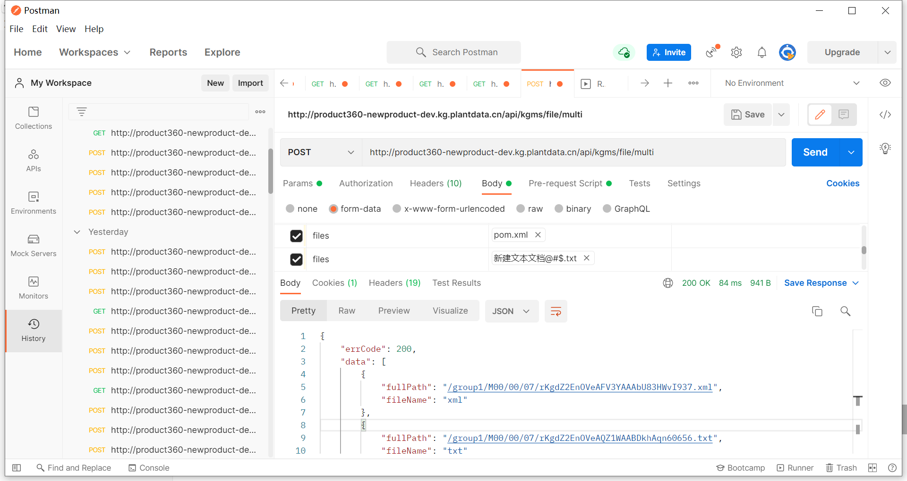

# Springboot-Thymeleaf-Customer-File

接口要写严格，一个接口一个用途。

这样别人调用接口时，不会有任何误会。


## 前言

之前的程序：

之前用springboot+thymeleaf做了前后端实现的用户的增删改查，现在要加个单文件上传、多文件上传与下载，并且优化页面。前面三大操作都是借助了项目提供的接口。我在自己的服务器上启动一个程序，通过调用它提供的接口，在项目服务器上实现三大功能，并且把相应的信息发送至Mysql，并实现可视化。

由于我的程序是对应了项目，所以有些地方具有特殊性。


## 先看页面


- 用户目录


list.html

```java
<!DOCTYPE html>
<html lang="en" xmlns:th="http://www.thymeleaf.org">
<head>
    <meta charset="UTF-8"/>
    <title>客户列表</title>
    <style>
        table{border-collapse:collapse;}
        table,th, td{border: 1px solid black;padding: 5px;text-align: center;}
    </style>
    <link rel="stylesheet" th:href="@{/css/bootstrap.css}"/>
</head>
<body class="container">
<br/>
<br/>
<a th:href="edit">新增用户</a>
<br/>
<br/>
<table>
    <thead>
    <th width="12.5%">id</th>
    <th width="12.5%">name</th>
    <th width="12.5%">age</th>
    <th width="12.5%">used</th>
    <th width="50%">操作</th>
    </thead>
    <tbody>
    <tr th:each="customer : ${customers}">
        <td th:text="${customer.id}"></td>
        <td th:text="${customer.name}"></td>
        <td th:text="${customer.age}"></td>
        <td th:text="${customer.used}"></td>
        <td>
            <a th:href="@{/customers/edit(id=${customer.id})}">编辑</a> &nbsp;
            <a th:href="@{/customers/goingToDel(pageNum=${pageNum},id=${customer.id})}">删除</a> &nbsp;
            <a th:href="@{/customers/file(customerId=${customer.id})}">单文件上传</a> &nbsp;
            <a th:href="@{/customers/multiple(customerId=${customer.id})}">多文件上传</a> &nbsp;
            <a th:href="@{/customers/goToFileSystem(customerId=${customer.id})}">我的文件</a> &nbsp;
        </td>
    </tr>
    </tbody>
</table>
<div th:text="当前页数"></div>
<div th:text="${pageNum}"></div>
<div class="modal-footer no-margin-top">
    <ul class="pagination pull-right no-margin">

        <!-- 首页 -->
        <li>
            <a th:href="'/customers/list?pageNum=0'">首页</a>
        </li>

        <!-- 上一页 -->
        <li th:if="${customers.hasPrevious()}">
            <a th:href="'/customers/list?pageNum=' + ${customers.previousPageable().getPageNumber()}" th:text="上一页"></a>
        </li>

        <!-- 中间页 -->
        <li th:each="pageNum:${#numbers.sequence(0, customers.getTotalPages()-1)}">
            <a th:href="'/customers/list?pageNum=' + ${pageNum}" th:text="${pageNum + 1}"  th:style="'font-weight:bold;background: #6faed9;'"></a>
        </li>

        <!-- 下一页 -->
        <li th:if="${customers.hasNext()}">
            <a th:href="'/customers/list?pageNum=' + ${customers.nextPageable().getPageNumber()}" th:text="下一页"></a>
        </li>

        <!-- 尾页 -->
        <li>
            <a th:href="'/customers/list?pageNum=' + ${customers.getTotalPages() - 1}">尾页</a>
        </li>

    </ul>
</div>
</body>
</html>
```


- 单文件上传


file.html

```java
<!DOCTYPE html>
<html xmlns="http://www.w3.org/1999/xhtml" xmlns:th="http://www.thymeleaf.org" xmlns:sec="http://www.thymeleaf.org/thymeleaf-extras-springsecurity3">
<head>
    <meta charset="UTF-8" />
    <title>Insert title here</title>
</head>
<body>
<h1 th:inlines="text">文件上传</h1>
<form th:action="@{/customers/singleFile(customerId=${customerId})}" method="post" enctype="multipart/form-data">
    <p>选择文件: <input type="file" name="file"/></p>
    <p><input type="submit" value="上传"/></p>
    <p><input type="button" value="返回" onclick="JavaScript:history.go(-1)" /></p>
</form>
</body>
</html>
```

​	

- 文件列表


fielList.html

```java
<!DOCTYPE html>
<html lang="en" xmlns:th="http://www.thymeleaf.org">
<head>
    <meta charset="UTF-8"/>
    <title>客户文件列表</title>
    <style>
        table{border-collapse:collapse;}
        table,th, td{border: 1px solid black;padding: 5px;text-align: center;}
    </style>
    <link rel="stylesheet" th:href="@{/css/bootstrap.css}"/>
    <script type="text/javascript">
        function confirmDel(fileId,customerId)
        {
            if(window.confirm("您确定要删除该条数据吗？")){
                document.location="/customers/delFile?fileId="+fileId+"&customerId="+customerId
            }
        }
    </script>
</head>
<body class="container">
<table>
    <thead>
    <th width="20%">线上文件Id</th>
    <th width="20%">线上文件用户Id</th>
    <th width="20%">线上文件名</th>
    <th width="20%">线上文件地址</th>
    <th width="20%">操作</th>
    </thead>
    <tbody>
    <tr th:each="file : ${files}">
        <td th:text="${file.fileId}"></td>:
        <td th:text="${file.customerId}"></td>
        <td th:text="${file.fileName}"></td>
        <td th:text="${file.fullPath}"></td>
        <td>
            <a th:href="@{/customers/download(fullPath=${file.fullPath},fileName=${file.fileName})}">下载</a> &nbsp;
            <a href="javascript:void(0)"  th:onclick="|confirmDel( ${file.fileId} ,${file.customerId}) |">删除</a>
        </td>
    </tr>
    </tbody>
    <div>
        <input type="button" value="返回" onclick="JavaScript:history.go(-1)" />
    </div>
</table>
</body>
</html>
```


- 下载文件


TestController中的一部分

```java
@GetMapping(value = "download")
public ResponseEntity<byte[]> download(@RequestParam("fullPath") String filePath,@RequestParam("fileName") String fileName) throws UnsupportedEncodingException {
    String authorization = "Bearer ...";
    byte[] res = feignService.downLoadFile(filePath,authorization);
    ResponseEntity<byte[]> entity = new ResponseEntity<byte[]>(HttpStatus.OK);
    HttpHeaders headers = new HttpHeaders();
    headers.add("Content-Type", "application/octet-stream");
    headers.add("Connection", "close");
    headers.add("Accept-Ranges", "bytes");
    headers.add("Content-Disposition",
            "attachment;filename=" + new String(fileName.getBytes("GB2312"), "ISO8859-1"));
    entity = new ResponseEntity<byte[]>(res, headers, HttpStatus.OK);
    return entity;
}
```


- 删除文件弹窗


```java
<script type="text/javascript">
    function confirmDel(fileId,customerId)
    {
        if(window.confirm("您确定要删除该条数据吗？")){
            document.location="/customers/delFile?fileId="+fileId+"&customerId="+customerId
        }
    }
</script>
```

```java
<a href="javascript:void(0)"  th:onclick="|confirmDel( ${file.fileId} ,${file.customerId}) |">删除</a>
```


- 多文件上传


multiple.html

```java
<!DOCTYPE html>
<html xmlns="http://www.w3.org/1999/xhtml" xmlns:th="http://www.thymeleaf.org"
      xmlns:sec="http://www.thymeleaf.org/thymeleaf-extras-springsecurity3">
<head>
    <meta charset="UTF-8" />
    <title>Insert title here</title>
</head>
<body>
<h1 th:inlines="text">文件上传</h1>
<form th:action="@{/customers/multiFiles(customerId=${customerId})}" method="post" enctype="multipart/form-data" >
    <p>选择文件1: <input type="file" name="files"/></p>
    <p>选择文件2: <input type="file" name="files"/></p>
    <p>选择文件3: <input type="file" name="files"/></p>
    <p>选择文件4: <input type="file" name="files"/></p>
    <p>选择文件5: <input type="file" name="files"/></p>
    <p><input type="submit" value="上传"/></p>
    <p><input type="button" value="返回" onclick="JavaScript:history.go(-1)" /></p>
</form>
</body>
</html>
```


- 选择任意数量不同或相同文件


这里有点复杂，之后讲


- 上传至不同用户管辖的文件列表 


- 点击"我的文件"直达文件系统


- 若该用户没有所属的文件，则显示空


## 接口文档阅读

作为小白，我之前没有读过接口文档说明。不同公司的接口文档不一样。

我这里使用了之前学习的Feign来调用这些接口，非常方便。


## 接口调用

不管是谁给的接口，只要我们要用，就要先postman调用，试试水。如果自己程序写好了，发现接口有问题导致delay，血亏。

随便举个例子



这些接口都会返回string字符串，我所要的文件线上地址以及错误码都需要我自己提取。


## 文件结构


## 程序里待调用的接口

```java
package com.mybatis_druid_mysql.demo.Service;

import com.mybatis_druid_mysql.demo.Entity.File;
import org.springframework.cloud.openfeign.FeignClient;
import org.springframework.stereotype.Service;
import org.springframework.web.bind.annotation.*;
import org.springframework.web.multipart.MultipartFile;

import java.util.List;

@FeignClient(name = "jerryNiu",url = "http://product360-newproduct-dev.kg.plantdata.cn/")
public interface FeignService {

    @PostMapping(value = "api/kgms/file",consumes = "multipart/form-data")
    String upLoadFile(@RequestPart(value = "file") MultipartFile file, @RequestHeader(value = "authorization") String authorization);

    @PostMapping(value = "api/kgms/file/multi",consumes = "multipart/form-data")
    String upLoadMultiFile(@RequestPart(value = "files") List<MultipartFile> files, @RequestHeader(value = "authorization") String authorization);

    @GetMapping(value = "api/kgms/file/download")
    byte[] downLoadFile(@RequestParam(value = "filePath") String filePath,@RequestHeader(value = "authorization") String authorization);

}
```

RequestPart:

Annotation that can be used to associate the part of a "multipart/form-data" request with a method argument.

RequestHeader:

Annotation which indicates that a method parameter should be bound to a web request header


## 启动类

```java
package com.mybatis_druid_mysql.demo;

import org.springframework.boot.SpringApplication;
import org.springframework.boot.autoconfigure.SpringBootApplication;
import org.springframework.cloud.openfeign.EnableFeignClients;

@SpringBootApplication
@EnableFeignClients
public class DemoApplication {
    public static void main(String[] args){
        SpringApplication.run(DemoApplication.class,args);
    }
}
```

EnableFeignClients:

Scans for interfaces that declare they are feign clients (via FeignClient @FeignClient). Configures component scanning directives for use with org.springframework.context.annotation.Configuration @Configuration classes.

MapperScan:

Use this annotation to register MyBatis mapper interfaces when using Java Config. It performs when same work as MapperScannerConfigurer via MapperScannerRegistrar.

至于其他俩注解就不介绍了。


## Controller

```java
package com.mybatis_druid_mysql.demo.Controller;


import com.mybatis_druid_mysql.demo.Entity.Customer;
import com.mybatis_druid_mysql.demo.Entity.File;
import com.mybatis_druid_mysql.demo.Service.FeignService;
import com.mybatis_druid_mysql.demo.Service.Service;
import lombok.extern.slf4j.Slf4j;
import org.springframework.beans.factory.annotation.Autowired;
import org.springframework.data.domain.Page;
import org.springframework.http.HttpHeaders;
import org.springframework.http.HttpStatus;
import org.springframework.http.MediaType;
import org.springframework.http.ResponseEntity;
import org.springframework.ui.ModelMap;
import org.springframework.web.bind.annotation.*;
import org.springframework.web.multipart.MultipartFile;

import javax.servlet.http.HttpServlet;
import java.io.*;
import java.util.ArrayList;
import java.util.Arrays;
import java.util.Iterator;
import java.util.List;

import org.springframework.ui.Model;
import org.springframework.web.bind.annotation.RequestMapping;


@org.springframework.stereotype.Controller
@RequestMapping("customers")
@Slf4j
public class TestController extends HttpServlet {

    @Autowired
    private Service service;

    @Autowired
    private FeignService feignService;
    ...
}
```


## 单文件上传

TestController里的一部分

```java
@RequestMapping("file")
public String file(ModelMap map, @RequestParam(value = "customerId") Integer customerId){
    map.addAttribute("customerId",customerId);
    return "customer/file";
}

@PostMapping(value = "singleFile" ,consumes = MediaType.MULTIPART_FORM_DATA_VALUE,
        produces = MediaType.APPLICATION_JSON_VALUE)
public String fileUpload(ModelMap map,
                         MultipartFile file,
                         @RequestParam(value = "customerId") Integer customerId){
    String authorization = "Bearer ...";
    File file1 = new File();
    file1.setCustomerId(customerId);
    file1.setFileName(file.getOriginalFilename());
    System.out.println("Hello World");
    System.out.println(file.getOriginalFilename());
    System.out.println(file.getContentType());
    file1.setFullPath(feignService.upLoadFile(file,authorization).substring(35,87));
    System.out.println(file1);
    if(file1.getFileId()==null){
        file1.setFileId(0);
    }
    else {
        file1.setFileId(file1.getFileId()+1);
    }
    System.out.println(file1);

    List<File> file2 = service.getAllFiles();
    System.out.println(file2);
    System.out.println(feignService.upLoadFile(file,authorization).substring(35,87));
    System.out.println(feignService.upLoadFile(file, authorization).substring(11,14));
    System.out.println(feignService.upLoadFile(file,authorization));

    log.error(feignService.upLoadFile(file,authorization));
    if(feignService.upLoadFile(file, authorization).substring(11,14).equals("200")){
        service.insertOneFile(file1);
        List<File> file3 = service.getAllFiles();
        map.addAttribute("files",file3);
        return "redirect:/customers/fileList?customerId="+customerId;
    }
    map.addAttribute("files",file2);
    return "redirect:/customers/fileList?customerId="+customerId;
}
```

ModelMap是向页面传数据的工具。

给Mysql传数据时，不用手动设置id，只要在Mysql中设置id为自增主键，他会自己配置。

MultiPartFile:

A representation of an uploaded file received in a multipart request.
The file contents are either stored in memory or temporarily on disk. In either case, the user is responsible for copying file contents to a session-level or persistent store as and if desired. The temporary storage will be cleared at the end of request processing.

**要看程序中各项数据的值，最好用log.info，而不是像这里用的sout。**


## 文件下载

```java
@GetMapping(value = "download")
public ResponseEntity<byte[]> download(@RequestParam("fullPath") String filePath,@RequestParam("fileName") String fileName) throws UnsupportedEncodingException {
    String authorization = "Bearer ...";
    byte[] res = feignService.downLoadFile(filePath,authorization);
    ResponseEntity<byte[]> entity = new ResponseEntity<byte[]>(HttpStatus.OK);
    HttpHeaders headers = new HttpHeaders();
    headers.add("Content-Type", "application/octet-stream");
    headers.add("Connection", "close");
    headers.add("Accept-Ranges", "bytes");
    headers.add("Content-Disposition",
            "attachment;filename=" + new String(fileName.getBytes("GB2312"), "ISO8859-1"));//获取文件名
    entity = new ResponseEntity<byte[]>(res, headers, HttpStatus.OK);
    return entity;
}
```

ResponseEntity：

Extension of HttpEntity that adds a HttpStatus status code. Used in RestTemplate as well

HttpEntity ：

Represents an HTTP request or response entity, consisting of headers and body.

这里的Headers与postman上写的headers如出一辙。

代码效果一开始就展示过了。


## 多文件上传

```java
/*
 * 获取multifile.html页面
 */
@RequestMapping("multiple")
public String multifile(ModelMap map, @RequestParam(value = "customerId") Integer customerId){
    map.addAttribute("customerId",customerId);
    return "customer/multiple";
}
```

```java
/**
 * 实现多文件上传
 * */
@PostMapping(value="multiFiles",
        consumes = MediaType.MULTIPART_FORM_DATA_VALUE,
        produces = MediaType.APPLICATION_JSON_VALUE)
public String multifileUpload(ModelMap map,
                              @RequestPart List<MultipartFile> files,
                              @RequestParam(value = "customerId") Integer customerId) throws IOException {
    String authorization = "Bearer ...";
    if(files.get(0).isEmpty()&&files.get(1).isEmpty()&&files.get(2).isEmpty()&&files.get(3).isEmpty()&&files.get(4).isEmpty()){
        return "redirect:/customers/fileList?customerId="+customerId;
    }

    System.out.println(files.size());
    //上传文件
    String result = feignService.upLoadMultiFile(files,authorization);
    System.out.println(result);
    int num = 0;//计算总文件数
    List<Integer> availableFile = new ArrayList<>();//记录非空的文件index
    List<String> filePath = new ArrayList<>();//记录各个文件线上地址

    //多文件上传返回值预处理
    String returnMessage;
    returnMessage = result
            .replaceAll("errCode","")
            .replaceAll("message","")
            .replaceAll("}","")
            .replace('{',':')
            .replaceAll(":","")
            .replaceAll(":","")
            .replaceAll(",","")
            .replace("\"", "")
            .replaceAll("data","")
            .replaceAll("]","")
            .replace('[',':')
            .replaceAll(":","")
            .replaceAll("fullPath","")
            .replaceAll("fileName"," : ");

    //分析并拆解上传文件的返回值
    for(int i=0 ; i<files.size() ; i++){
        if(!files.get(i).isEmpty()){
            availableFile.add(i);//第i号文件有东西
            num++;
            log.info(returnMessage);
            int begin = returnMessage.lastIndexOf("/");
            int end = returnMessage.lastIndexOf(":");
            log.info(returnMessage.substring(begin-17,end-1));
            filePath.add(returnMessage.substring(begin-17,end-1));

            log.info(returnMessage.replaceAll(returnMessage.substring(begin-17,end-1),""));
            returnMessage = returnMessage.replaceAll(returnMessage.substring(begin-17,end-1),"");
            log.info(returnMessage.substring(0,returnMessage.lastIndexOf(":")-1));
            returnMessage = returnMessage.substring(0,returnMessage.lastIndexOf(":")-1);
        }
        else {
            files.remove(i);
            if(i!=0)
                i--;//https://it4all.blog.csdn.net/article/details/77915981
        }
    }

    //同步上传mysql
    System.out.println(filePath);
    for(int i=0 ; i<num ; i++ ){
        File file = new File();
        file.setFileName(files.get(availableFile.get(i)).getOriginalFilename());
        log.info(files.get(availableFile.get(i)).getOriginalFilename());
        file.setFullPath(filePath.get(num-i-1));
        file.setFileId(0);
        file.setCustomerId(customerId);
        service.insertOneFile(file);
    }

    System.out.println(files.size());

    //打印Mysql
    List<File> file2 = service.getAllFiles();
    map.addAttribute("files",file2);
    return "redirect:/customers/fileList?customerId="+customerId;
}
```

多文件上传逻辑就复杂一些。我希望当用户选择多文件上传时，最多一次传5个文件。项目给我的接口的文件数量远大于我要的5。我需要实现用户传的文件数小于5时，将空文件删除。并且将返回的字符串整理成我需要的线上文件地址。并且同步到Mysql中。

MultipartFile：

A representation of an uploaded file received in a multipart request.


## 文件删除

这里的删除并不是在项目服务器上把文件删除，而是在Mysql表中删除数据。因为项目没给相应的删除文件的接口。

```java
@RequestMapping("delFile")
public String delFile(ModelMap map, @RequestParam(value = "fileId") Integer fileId,
                      @RequestParam(value = "customerId") Integer customerId){
    service.deleteFile(fileId);
    List<File> file2 = service.getAllFiles();
    System.out.println(file2);
    map.addAttribute("files",file2);
    System.out.println("ok");
    return "redirect:/customers/fileList?customerId="+customerId;
}
```


## 查看文件

用户之前都要先上传文件，才能看到文件列表。现在我希望能直接有个查看文件列表的接口。

```java
@GetMapping(value = "fileList")
public String fileList(ModelMap map,
                         @RequestParam(value = "customerId") Integer customerId){
    List<File> file2 = service.getByCustomerId(customerId);
    map.addAttribute("files",file2);
    return "customer/fileList";
}
```


## Mysql表同步

我这里通过mybatis里的mapper实现与mysql的信息交互。

```java
@Insert("insert into files(file_name,full_path,customer_id) values(#{fileName},#{fullPath},#{customerId})")
@Options(useGeneratedKeys = true,keyColumn = "file_id",keyProperty = "fileId")//展示id只有insert时要
void insertOneFile(File file);

 @Select("select * from files where customer_id = #{customerId}")
    @Results( value = {                 //!!!!
            @Result(property = "fileId", column = "file_id"),
            @Result(property = "fileName", column = "file_name"),
            @Result(property = "fullPath", column = "full_path"),
            @Result(property = "customerId", column = "customer_id")})
    List<File> getByCustomerId(@Param("customerId") int customerId);

    @Select("select * from files where file_id = #{fileId}")
    @Results( value = {                 //!!!!
            @Result(property = "fileId", column = "file_id"),
            @Result(property = "fileName", column = "file_name"),
            @Result(property = "fullPath", column = "full_path"),
            @Result(property = "customerId", column = "customer_id")})
    File getByFileId(@Param("fileId") int fileId);

    @Select("select * from files")
    @Results( value = {                 //!!!!
            @Result(property = "fileId", column = "file_id"),
            @Result(property = "fileName", column = "file_name"),
            @Result(property = "fullPath", column = "full_path"),
            @Result(property = "customerId", column = "customer_id")})
    List<File> getAllFiles();

    @Delete("delete from files where file_id = #{fileId}")
    void delFile(@Param("fileId") int fileId);
```


file实体类(**注意**！！！这里的file不是jdk里的file，而是我自己设置的实体类！！！

```java
@Entity(name = "files")
@Data
public class File implements Serializable {

    private static final long serialVersionUID = 1L;

    @Id
    private Integer fileId;
    private String fileName;
    private String fullPath;
    private Integer customerId;

}
```

我在Navicat中把fileId调成自增主键后，会出现一个问题：Mysql默认主键名为id，我们再用Mapper使用Mysql语句时，要将表中的file_id与fileId一一对应，否则就算在Navicat中看到file_id下的数据是存在的，在select时，会报错说fileId不能是空。

怎么一一对应呢？举个例子。

```java
@Delete("delete from files where file_id = #{fileId}")
@Options(useGeneratedKeys = true,keyColumn = "fileId")
@Results( value = {                 //!!!!
        @Result(property = "fileId", column = "file_id"),
        @Result(property = "fileName", column = "file_name"),
        @Result(property = "fullPath", column = "full_path"),
        @Result(property = "customerId", column = "customer_id")})
void delFile(@Param("fileId") int fileId);
```


produces：它的作用是指定返回值类型，不但可以设置返回值类型还可以设定返回值的字符编码；

consumes： 指定处理请求的提交内容类型（Content-Type），例如application/json, text/html;

enctype 属性规定在发送到服务器之前应该如何对表单数据进行编码。


Service层对Mapper层的调用我就不写了。


同步到mysql的数据传输我使用了druid。

```java
package com.mybatis_druid_mysql.demo.Druid;

import com.alibaba.druid.pool.DruidDataSource;
import org.springframework.beans.factory.annotation.Value;
import org.springframework.boot.SpringBootConfiguration;
import org.springframework.context.annotation.Bean;
import org.springframework.context.annotation.PropertySource;
import org.springframework.transaction.annotation.EnableTransactionManagement;

import javax.sql.DataSource;

@SpringBootConfiguration
@PropertySource(value = "classpath:/application.properties")
@EnableTransactionManagement
public class Druid {
    @Value("${spring.datasource.druid.username}")
    private String userName;
    @Value("${spring.datasource.druid.password}")
    private String password;
    @Value("${spring.datasource.druid.driver-class-name}")
    private String driverName;
    @Value("${spring.datasource.druid.url}")
    private String url;

    @Value("${spring.datasource.druid.initial-size}")
    private int initialSize;
    @Value("${spring.datasource.druid.max-active}")
    private int maxActive;
    @Value("${spring.datasource.druid.min-idle}")
    private int minIdle;
    @Value("${spring.datasource.druid.max-wait}")
    private int maxWait;
    @Value("${spring.datasource.druid.timeBetweenEvictionRunsMillis}")
    private int timeBetweenEvictionRunsMillis;
    @Value("${spring.datasource.druid.minEvictableIdleTimeMillis}")
    private int minEvictableIdleTimeMillis;
    @Value("${spring.datasource.druid.maxPoolPreparedStatementPerConnectionSize}")
    private int maxPoolPreparedStatementPerConnectionSize;

    @Bean(name = "datasource")
    public DataSource dataSource(){//由druid-spring-boot-starter实现springboot提供的datasource接口
        DruidDataSource dataSource = null;
        try{
            dataSource = new DruidDataSource();
            dataSource.setUsername(userName);
            dataSource.setPassword(password);
            dataSource.setUrl(url);
            dataSource.setDriverClassName(driverName);
            dataSource.setInitialSize(initialSize);
            dataSource.setMaxActive(maxActive);
            dataSource.setMinIdle(minIdle);
            dataSource.setMaxWait(maxWait);
            dataSource.setTimeBetweenEvictionRunsMillis(timeBetweenEvictionRunsMillis);
            dataSource.setMinEvictableIdleTimeMillis(minEvictableIdleTimeMillis);
            dataSource.setMaxPoolPreparedStatementPerConnectionSize(maxPoolPreparedStatementPerConnectionSize);
        }catch (Exception e){
            e.printStackTrace();
        }
        return dataSource;
    }
}
```

这串代码我在以前的文章大致讲过。


这样，就完成了。


​	
