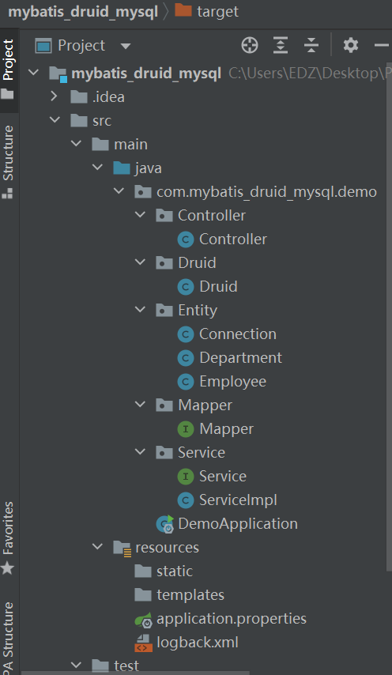
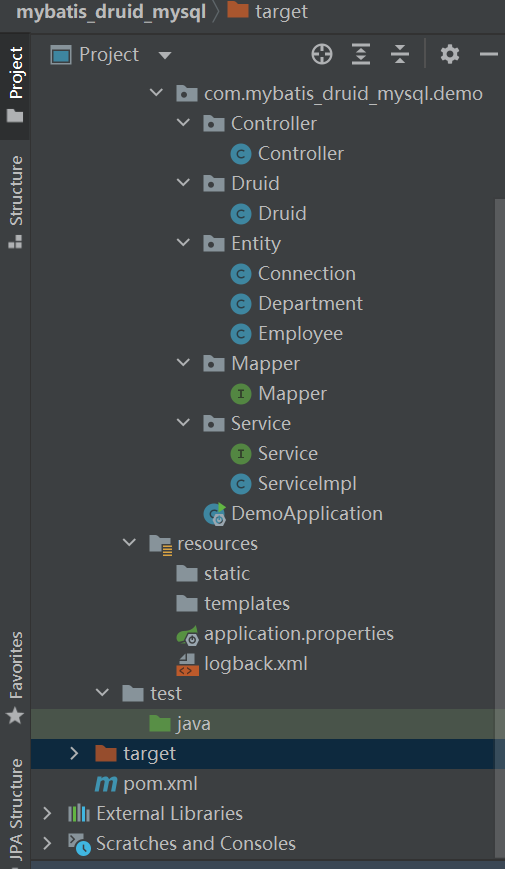

# **基于Maven+ SpringMVC+ MyBatis +Druid+MySql员工管理系统新手教程**

## 前言

百度上搜这个还能跳出来个100+RMB的课程。这课有好多人看。我看了一下目录，发现大概比我的系统全面。但是，如果你只是要使用这些工具搭建一个员工管理系统，看我的就够了。虽然我只是个新手，但是我实现了，并且尽我所能讲清楚代码。


## 项目目标

我们搭建的员工管理系统是要有员工，部门和员工，部门的关系和对前三者在应用场景下的增删改查。

具体来说，对于员工和部门的增删改查是较简单的。只需注意增时要保证员工或部门不存在，删时保证员工或部门存在，改时保证员工或部门存在并且查时能用名字或id查找。对于两者关系的增删改查稍微变了些东西。查的时候通过部门名字查找所有该部门的员工信息，包括员工个数并且这些员工和部门要存在且id一致。


## 工具介绍

Maven是用来下各种各样jar包的。

### SpringMVC

这是个设计框架。主要由**模块层（Model），视图层（View）和控制层（controller）**组成。


- 模块层封装了数据与进行数据进行处理的代码，是实际经行数据处理的地方，也是与数据库交互的地方。我的代码里包括Service，ServiceImpl和Mapper来处理数据。其实，在写这个项目时，大可不必分这么多层，会显得徒增代码量，但是这是个要养成的好习惯，至少要知道分层思想。
- 视图层负责将应用显示给用户和显示模型的状态。这主要是前端干的事，和我后端无瓜。我们的视图由Navicat解决。
- 控制层负责视图和模型之间的交互，把用户的请求发送到对应的模型上，并把模型的改变及时反应到视图上。


### Mysql

这是个数据库。结构从上到下依次是**数据库（database）和表（table）**。


### Mybatis

我们java程序中存储的数据是对象，**怎么把对象转化成mysql中的表呢？**靠的就是mybatis。


### Druid

这是**一个数据传输时的连接池**。用这个是为了**数据传输时加速与省消耗**。以前每次连接数据库都要建立联系，就像每次回家，都要买辆车；如果用连接池，它会把我们数据传输时用的放进去，要用时从里面拿就行了，就像共享单车。


具体的点之后和代码一起补充。

我使用的是IDEA（编程），Postman（调用接口）和Navicat（mysql数据可视化）。

其中Navicat还提供直接用Mysql命令操作数据库的功能。菜单里点击Query，再点击newQuery，就能直接写Mysql语句来验证程序里的命令是否正确。非常方便。


## 开始制作

### 创建Mysql表

如果你是在本地玩，需要在本地先起一个Mysql服务。我下了个5开头的版本。

https://dev.mysql.com/downloads/file/?id=506120

在Navicat上连接Mysql。先创建个Mysql的数据库。记住你的数据库名，之后要用。


### 文件结构





其中，logback.xml是为了打印logback日志使用的，之后会讲到。你如果要按照我的程序制作，就不需要写这个文件，也不能写这个文件


### Pom.xml

```java
<?xml version="1.0" encoding="UTF-8"?>
<project xmlns="http://maven.apache.org/POM/4.0.0" xmlns:xsi="http://www.w3.org/2001/XMLSchema-instance"
         xsi:schemaLocation="http://maven.apache.org/POM/4.0.0 https://maven.apache.org/xsd/maven-4.0.0.xsd">
    <modelVersion>4.0.0</modelVersion>
    <parent>
        <groupId>org.springframework.boot</groupId>
        <artifactId>spring-boot-starter-parent</artifactId>
        <version>2.5.2</version>
        <relativePath/> <!-- lookup parent from repository -->
    </parent>
    <groupId>com.vue</groupId>
    <artifactId>mybatis_druid_mysql</artifactId>
    <version>0.0.1-SNAPSHOT</version>
    <name>mybatis_druid_mysql</name>
    <description>mybatis_druid_mysql</description>

    <properties>
        <java.version>1.8</java.version>
    </properties>

    <dependencies>
        <dependency>
            <groupId>org.springframework.boot</groupId>
            <artifactId>spring-boot-starter-data-jpa</artifactId>
        </dependency>
        <dependency>
            <groupId>org.mybatis.spring.boot</groupId>
            <artifactId>mybatis-spring-boot-starter</artifactId>
        </dependency>

        <!-- web依赖，包含servlet,内置tomcat等 -->
        <dependency>
            <groupId>org.springframework.boot</groupId>
            <artifactId>spring-boot-starter-web</artifactId>
        </dependency>


        <!-- mysql依赖 -->
        <dependency>
            <groupId>mysql</groupId>
            <artifactId>mysql-connector-java</artifactId>
            <scope>runtime</scope>
        </dependency>

        <!-- mybatis依赖 -->
        <dependency>
            <groupId>org.mybatis.spring.boot</groupId>
            <artifactId>mybatis-spring-boot-starter</artifactId>
            <version>1.3.2</version>
        </dependency>

        <!-- druid依赖包，配合springBoot项目使用 -->
        <dependency>
            <groupId>com.alibaba</groupId>
            <artifactId>druid-spring-boot-starter</artifactId>
            <version>1.1.14</version>
        </dependency>
        <dependency>
            <groupId>org.projectlombok</groupId>
            <artifactId>lombok</artifactId>
        </dependency>
    </dependencies>

    <build>
        <plugins>
            <plugin>
                <groupId>org.springframework.boot</groupId>
                <artifactId>spring-boot-maven-plugin</artifactId>
            </plugin>
        </plugins>
    </build>

</project>
```


### 启动类

```java
@Service
@SpringBootApplication
@MapperScan("/com.mybatis_druid_mysql.demo.Mapper")
public class DemoApplication {
    public static void main(String[] args){
        SpringApplication.run(DemoApplication.class,args);
    }
}
```

与以往不同，多了个*@MapperScan*。它在用到java配置时登记Mybatis的Mapper接口。


### Druid连接

就像上文提及，druid像共享单车。那么我们就要规定各项指标，比如有多少单车，每条车可以骑多久等等。


application.properties配置文件

```java
server.port=18001

spring.datasource.druid.driver-class-name=com.mysql.cj.jdbc.Driver
spring.datasource.druid.url=(1)
spring.datasource.druid.username=root
spring.datasource.druid.password=password

spring.datasource.druid.initial-size=5
spring.datasource.druid.max-active=20
spring.datasource.druid.min-idle=5
spring.datasource.druid.max-wait=60000
spring.datasource.druid.timeBetweenEvictionRunsMillis=60000
spring.datasource.druid.minEvictableIdleTimeMillis=300000
spring.datasource.druid.maxPoolPreparedStatementPerConnectionSize=200
```

第一行是我们程序的端口。


（1） 这里是你的mysql数据库的url，形如：jdbc:mysql://127.0.0.1/db_example?serverTimezone=Asia/Shanghai&useUnicode=true&characterEncoding=utf-8&useSSL=false

其中，db_example是数据库的名字。？后面代表一些参数。


第五行开始就是一些各种各样的druid设置。


**怎么样让程序调用上这些配置呢？**

```java
package com.mybatis_druid_mysql.demo.Druid;

import com.alibaba.druid.pool.DruidDataSource;
import org.springframework.beans.factory.annotation.Value;
import org.springframework.boot.SpringBootConfiguration;
import org.springframework.context.annotation.Bean;
import org.springframework.context.annotation.PropertySource;
import org.springframework.transaction.annotation.EnableTransactionManagement;

import javax.sql.DataSource;

@SpringBootConfiguration
@PropertySource(value = "classpath:/application.properties")
@EnableTransactionManagement
public class Druid {
    @Value("${spring.datasource.druid.username}")
    private String userName;
    @Value("${spring.datasource.druid.password}")
    private String password;
    @Value("${spring.datasource.druid.driver-class-name}")
    private String driverName;
    @Value("${spring.datasource.druid.url}")
    private String url;

    @Value("${spring.datasource.druid.initial-size}")
    private int initialSize;
    @Value("${spring.datasource.druid.max-active}")
    private int maxActive;
    @Value("${spring.datasource.druid.min-idle}")
    private int minIdle;
    @Value("${spring.datasource.druid.max-wait}")
    private int maxWait;
    @Value("${spring.datasource.druid.timeBetweenEvictionRunsMillis}")
    private int timeBetweenEvictionRunsMillis;
    @Value("${spring.datasource.druid.minEvictableIdleTimeMillis}")
    private int minEvictableIdleTimeMillis;
    @Value("${spring.datasource.druid.maxPoolPreparedStatementPerConnectionSize}")
    private int maxPoolPreparedStatementPerConnectionSize;

    @Bean(name = "datasource")
    public DataSource dataSource(){//由druid-spring-boot-starter实现springboot提供的datasource接口
        DruidDataSource dataSource = null;
        try{
            dataSource = new DruidDataSource();
            dataSource.setUsername(userName);
            dataSource.setPassword(password);
            dataSource.setUrl(url);
            dataSource.setDriverClassName(driverName);
            dataSource.setInitialSize(initialSize);
            dataSource.setMaxActive(maxActive);
            dataSource.setMinIdle(minIdle);
            dataSource.setMaxWait(maxWait);
            dataSource.setTimeBetweenEvictionRunsMillis(timeBetweenEvictionRunsMillis);
            dataSource.setMinEvictableIdleTimeMillis(minEvictableIdleTimeMillis);
            dataSource.setMaxPoolPreparedStatementPerConnectionSize(maxPoolPreparedStatementPerConnectionSize);
        }catch (Exception e){
            e.printStackTrace();
        }
        return dataSource;
    }
}
```

*@SpringBootConfiguration*注释是**一个类级别的注释，它指示此类提供了应用程序配置。**

*@PropertySource*(value = "classpath:/application.properties")注释是**一个读取properties配置文件属性的注释，塔指示了配置文件地址。**

*@EnableTransactionManagement*注释是**一个事务管理注解。**

*@Value*注释是**一个从属性源取值的注释，它后面写注释源的名称。**


上面代码设置了dataSource。之后就会交给druid-spring-boot-starter这个依赖处理。


这样，Druid就连接完成啦！


### **Entity创建**

实体（Entity）定义了我们数据的基本结构。比如，我们这里要做3张表：员工信息表，部门信息表和员工部门关系表。


Employee

```java
@Entity(name = "employee")
@Data
public class Employee {
    @Id
    Long id;
    String name;
    String sex;
    String address;
}
```

*@Entity(name = "employee")*注释说明**这是一个实体，而且名字叫employee。**

*@Data*注释说明**这是一个数据，它代替了普通的getter和setter。**

*@Id*注释说明**这是这个实体的主键（primary key）。**


Department

```java
@Entity(name = "department")
@Data
public class Department {
    @Id
    Long department_id;
    String department_name;
}
```


Connection

```java
@Entity(name = "connection")
@Data
public class Connection {

    @Id
    Long connection_id;

    Long department_id;

    Long employee_id;

    String employee_name;

    String department_name;
}
```


### 数据处理

从端口调用接口到实现数据的增上改查（CRUD），是怎么实现的呢？

我的总共个分为这么几层：Controller->Service->ServiceImpl->Mapper。正规一点还要加上一层Dao层。


#### Controller

```java
@RestController
@RequestMapping("/jerry")
@Slf4j
public class Controller {

    @Autowired
    private Service service;

    @PostMapping(value = "/insertEmployee", produces = MediaType.APPLICATION_JSON_UTF8_VALUE,
        consumes = MediaType.APPLICATION_JSON_UTF8_VALUE)
    public Employee insertEmployee(@RequestBody Employee employee){
        if(service.countEmployee(employee)==0)
            service.insertEmployee(employee);
        return employee;
    }

    @DeleteMapping("/deleteEmployee")
    public String deleteEmployee(@RequestParam String id){
        service.deleteEmployee(id);
        return "deleted";
    }

    @PutMapping(value = "/updateEmployee" , produces = MediaType.APPLICATION_JSON_UTF8_VALUE,
            consumes = MediaType.APPLICATION_JSON_UTF8_VALUE)
    public Employee updateEmployee(@RequestParam Long id,@RequestBody Employee employee){
        employee.setId(id);
        service.updateEmployee(employee);
        log.info("result: {}", employee);//打印日志
        return employee;
    }

    @GetMapping(value = "/searchEmployee", produces = MediaType.APPLICATION_JSON_UTF8_VALUE)
        public Employee searchEmployee(@RequestParam("id") String id){
        return service.searchEmployee(id);
    }

    @PostMapping(value = "/addDepartment",produces = MediaType.APPLICATION_JSON_UTF8_VALUE,
            consumes = MediaType.APPLICATION_JSON_UTF8_VALUE)
    @ResponseBody
    public Department addDepartment(@RequestBody Department department){
        if(service.countDepartment(department)==0)
            service.addDepartment(department);
        return department;
    }

    @DeleteMapping("/deleteDepartment")
    @ResponseBody
    public String deleteDepartment(@RequestParam Long department_id){
        service.deleteDepartment(department_id);
        return "deleted";
    }

    @GetMapping(value = "/searchDepartment",produces = MediaType.APPLICATION_JSON_UTF8_VALUE)
        public Department searchDepartment(@RequestParam("department_id") String department_id){
        log.info("result: {}", service.searchDepartment(department_id));//打印日志
        Department department = service.searchDepartment(department_id);
        return service.searchDepartment(department_id);
    }

    @PutMapping(value = "/updateDepartment",produces = MediaType.APPLICATION_JSON_UTF8_VALUE,
        consumes = MediaType.APPLICATION_JSON_UTF8_VALUE)
    @ResponseBody
    public Department updateDepartment(@RequestParam Long department_id,@RequestBody Department department){
        department.setDepartment_id(department_id);
        service.updateDepartment(department);
        return department;
    }

    @RequestMapping(value = "/addConnection",produces = MediaType.APPLICATION_JSON_UTF8_VALUE,
        consumes = MediaType.APPLICATION_JSON_UTF8_VALUE)
    @ResponseBody
    public Connection addConnection(@RequestBody Connection connection){
        if(service.countConnection(connection)==0&&(service.employeeExistAndIdCorrect(connection)==1
        &&(service.departmentExistAndIdCorrect(connection)==1)))
            service.addConnection(connection);
        return connection;
    }

    @RequestMapping("/deleteConnection")
    @ResponseBody
    public String deleteConnection(Long connection_id){
        service.deleteConnection(connection_id);
        return "deleted";
    }

    @RequestMapping("/deleteEmployeeFromDepartment")
    @ResponseBody
    public String deleteEmployeeFromDepartment(@RequestParam("employee_id") Long employee_id,@RequestParam("department_id") Long department_id){
        service.deleteEmployeeFromDepartment(employee_id,department_id);
        return "deleted";
    }

    @RequestMapping("/updateConnection")
    @ResponseBody
    public String updateConnection(@RequestBody Connection connection,@RequestParam Long connection_id){
        connection.setConnection_id(connection_id);
        service.updateConnection(connection);
        return "updated";
    }

    @RequestMapping("/searchEmployeeFromDepartment")
    @ResponseBody
    public List<Connection> searchEmployeeFromDepartment(String department_name){
        return service.searchEmployeeFromDepartment(department_name);
    }

    @RequestMapping("/searchDepartmentFromEmployee")
    @ResponseBody
    public List<Connection> searchDepartmentFromEmployee(String employee_name){
        return service.searchDepartmentFromEmployee(employee_name);
    }

    @RequestMapping("/countEmployeeFromDepartment")
    @ResponseBody
    public Long countEmployeeFromDepartment(String department_name){
        return service.countEmployeeFromDepartment(department_name);
    }


}
```

*@RestController*注释是**一个连接了两种其他注释的注释**，他们分别是*@Controller*和*@ResponseBody*，前者告诉系统这是个**控制类**，并且暗含*@Component*，**能被系统扫描到**；后者告诉系统这里**返回的数据**是**以网络反应体（web response body）展示**的，不是普通的返回数据。

*@RequestMapping("/jerry")*注释是**一个引导网络请求到请求处理类的注释，它定义了调用接口时的路径。**

*@Slf4j*注释是**一个来自lombok依赖的注释，他能打印日志。**

*@Autowired*注释是**一个自动导航的注释，它能把@Component注释下的类纳为己用。**

*@PostMapping*注释是*@RequestMapping*的一种，它要求请求时用**Post**方法调用。这种方法通常用在增删改查中的**增**。

*@DeleteMapping*注释是*@RequestMapping*的一种，它要求请求时用**Delete**方法调用。这种方法通常用在增删改查中的**删**。

*@PutMapping*注释是*@RequestMapping*的一种，它要求请求时用**Put**方法调用。这种方法通常用在增删改查中的**改**。

*@GetMapping*注释是*@RequestMapping*的一种，它要求请求时用**Get**方法调用。这种方法通常用在增删改查中的**查**。

**以上四者都能定义请求调用时的路径和输入输出的数据形式。比如Json形式，方便观察。**

我代码中前面还是挺规范，到后面全是*@RequestMapping*，这不好。

*@RequestParam*和*@RequestBody*都是**定义网络请求参数名称，前者参数是普通参数（parameter)，比如String或Long；后者参数是一个类。**

我代码中前面还是挺规范，到后面全都漏了，这不好。


你可能注意到了，我的所有实体的属性都是小写，单词之间由下划线分开。比如department_name。这是因为如果不这么做，Mysql会自动把这些属性转化成表中的Title时，自动变小写，单词用下划线分开。按理说分开就分开，但是我试了一下，会引起一个我搞不懂的bug。于是就向Mysql妥协。


#### Service

这就是个接口类，由ServiceImpl实现。

```java
@org.springframework.stereotype.Service
public interface Service {
    public void insertEmployee(Employee employee);

    public Long countEmployee(Employee employee);

    public void deleteEmployee(String id);

    public void updateEmployee(Employee employee);

    public Employee searchEmployee(String id);

    public void addDepartment(Department department);

    public Long countDepartment(Department department);

    public void deleteDepartment(Long department_id);

    public Department searchDepartment(String department_id);

    public void updateDepartment(Department department);

    public void addConnection(Connection connection);

    public Long countConnection(Connection connection);

    public void deleteConnection(Long connection_id);

    public void updateConnection(Connection connection);

    public List<Connection> searchEmployeeFromDepartment(String department_id);

    public List<Connection> searchDepartmentFromEmployee(String employee_name);

    public Long countEmployeeFromDepartment(String department_name);

    public void deleteEmployeeFromDepartment(Long employee_id,Long department_id);

    public Long employeeExistAndIdCorrect(@Param("connection") Connection connection);

    public Long departmentExistAndIdCorrect(@Param("connection") Connection connection);
}
```

*@Service*注释是**一个指明该类是个独立服务层的注释，**它是*@Component*的一种，**能被扫描到**。

这里它变成*@org.springframework.stereotype.Service*这么长，是因为我的类名也是Service，系统为了区分，就写长了。


#### ServiceImpl

```java
@org.springframework.stereotype.Service
@Transactional
public class ServiceImpl implements Service{
    @Autowired
    private Mapper mapper;

    public void insertEmployee(Employee employee){
        mapper.insertEmployee(employee);
    }

    public Long countEmployee(Employee employee){
        return mapper.countEmployee(employee);
    }

    public void deleteEmployee(String id){
        mapper.deleteEmployee(id);
    }

    public void updateEmployee(Employee employee){
        mapper.updateEmployee(employee);
    }

    public Employee searchEmployee(String id){
        return mapper.searchEmployee(id);
    }

    public void addDepartment(Department department){
        mapper.addDepartment(department);
    }

    public Long countDepartment(Department department){return mapper.countDepartment(department);}

    public void deleteDepartment(Long department_id){
        mapper.deleteDepartment(department_id);
    }

    public Department searchDepartment(String department_id){
        return mapper.searchDepartment(department_id);
    }

    public void updateDepartment(Department department){
        mapper.updateDepartment(department);
    }

    public void addConnection(Connection connection){
        mapper.addConnection(connection);
    }

    public Long countConnection(Connection connection){return mapper.countConnection(connection);}

    public void deleteConnection(Long connection_id){
        mapper.deleteConnection(connection_id);
    }

    public void updateConnection(Connection connection){
        mapper.updateConnection(connection);
    }

    public List<Connection> searchDepartmentFromEmployee(String employee_name){
        return mapper.searchDepartmentFromEmployee(employee_name);
    }

    public List<Connection> searchEmployeeFromDepartment(String department_name){
        return mapper.searchEmployeeFromDepartment(department_name);
    }

    public Long countEmployeeFromDepartment(String department_name){
        return mapper.countEmployeeFromDepartment(department_name);
    }

    public void deleteEmployeeFromDepartment(Long employee_id,Long department_id){
        mapper.deleteEmployeeFromDepartment(employee_id,department_id);
    }

    public Long employeeExistAndIdCorrect(@Param("connection") Connection connection){
        return mapper.employeeExistAndIdCorrect(connection);
    }

    public Long departmentExistAndIdCorrect(@Param("connection") Connection connection){
        return mapper.departmentExistAndIdCorrect(connection);
    }
}
```

*@Transactional*注释是**一个为独立方法或一个类的转换属性的注释。**


#### Mapper

使用Mysql命令，用于将对象与Mysql里的表打交道。

```java
@org.apache.ibatis.annotations.Mapper
public interface Mapper {

    @Insert("insert into employee(name,sex,address) values(#{name},#{sex},#{address})")
    @Options(useGeneratedKeys = true,keyColumn = "id")//展示id
    void insertEmployee(Employee employee);

    @Select("select count(*) from employee where name = #{name}")
    Long countEmployee(Employee employee);

    @Delete("delete from employee where id = #{id}")
    void deleteEmployee(@Param("id") String id);

    @Update("update employee set name = #{name},sex = #{sex},address = #{address} where id = #{id}")
    @Options(useGeneratedKeys = true,keyColumn = "id")
    void updateEmployee(@Param("employee") Employee employee);

    @Select("select * from employee where id = #{id}")
    @Options(useGeneratedKeys = true,keyColumn = "id")
    Employee searchEmployee(@Param("id") String id);

    @Insert("insert into department(department_name) values(#{department_name})")
    @Options(useGeneratedKeys = true,keyProperty = "department_id")
    void addDepartment(Department department);

    @Select("select count(*) from department where department_name = #{department_name}")
    Long countDepartment(Department department);

    @Delete("delete from department where department_id = #{department_id}")
    void deleteDepartment(@Param("department_id")  Long department_id);

    @Select("select * from department where department_id = #{department_id}")
    @Options(useGeneratedKeys = true,keyProperty = "department_id")
    Department searchDepartment(@Param("department_id")  String department_id);

    @Update("update department set department_id = #{department_id}, department_name = #{department_name} where department_id = #{department_id}")
    @Options(useGeneratedKeys = true,keyColumn = "department_id",keyProperty = "department_id")
    void updateDepartment(@Param("department") Department department);


    @Insert("insert into connection(department_id,department_name,employee_id,employee_name)values(#{department_id},#{department_name},#{employee_id},#{employee_name})")
    @Options(useGeneratedKeys = true,keyColumn = "connection_id",keyProperty = "connection_id")
    void addConnection(Connection connection);

    @Select("select count(*) from connection where department_name = #{department_name} and employee_name = #{employee_name}")
    Long countConnection(Connection connection);

    @Delete("delete from connection where connection_id = #{connection_id}")
    void deleteConnection(Long connection_id);

    @Delete("delete from connection where employee_id = #{employeeId} and department_id = #{department_id}")
    void deleteEmployeeFromDepartment(@Param("employeeId") Long employee_id,
                                      @Param("department_id") Long department_id);

    @Update("update connection set employee_id = #{employee_id}, employee_id = #{employee_id}, department_id = #{department_id} , employee_name = #{employee_name} where connection_id = #{connection_id}")
    @Options(useGeneratedKeys = true,keyColumn = "connection_id",keyProperty = "connection_id")
    void updateConnection(Connection connection);

    @Select("select * from connection where employee_name = #{employee_name}")
    @Options(useGeneratedKeys = true,keyColumn = "employee_name",keyProperty = "employee_name")
    List<Connection> searchDepartmentFromEmployee(String employee_name);

    @Select("select * from connection where department_name = #{department_name}")
    @Options(useGeneratedKeys = true,keyColumn = "department_name",keyProperty = "department_name")
    List<Connection> searchEmployeeFromDepartment(@Param("department_name") String department_name);

    @Select("select count(*) from connection where department_name = #{department_name}")
    public Long countEmployeeFromDepartment(@Param("department_name") String department_name);

    @Select("select count(*) from employee where name = #{employee_name} and id = #{employee_id}")
    public Long employeeExistAndIdCorrect(@Param("connection") Connection connection);

    @Select("select count(*) from department where department_name = #{department_name} and department_id = #{department_id}")
    public Long departmentExistAndIdCorrect(@Param("connection") Connection connection);
}
```

以上括号内的语句就是Mysql命令，其相关意思网上多的很，我就不解释了。就算是新人也能通过字面意思与上文结合，猜知大概。


### Navicat使用

其实这里应该与代码测试穿插着用，上文到这不是真正开始制作的顺序。

如果ENtity内写了表名，那么在最开始船舰的数据库下就会自动生成相应的表，以及该表的第一列；若没有，则手动生成。

在每次调用接口测试代码时，它会要求每张表都要有自增主键。于是，我们要右键表名，选择“Design Table”，选择相应主键，勾选自增（Auto-Increment）。

它刷新时间意不要用右键选择刷新，而要用底部的刷新键，或是重启Navicat。


### 注意事项

除了上文所提及的各种事项，我再整理一些修理bug的总结。

- 各种依赖包内的类别引用错了，很多都是同名的，注意选择你想要的。假如你和我一样对理论不熟悉，就要点开（“ctrl" + 左键）这些类一看究竟。有时他甚至不会一下显示这些同名的类，坑的我好惨。
- 写代码要规范，养成好习惯。有许多现在看来可写可不写的，那是因为我们程序功能简单。以后功能复杂起来，再不写规范，那就是一坨屎，不仅没人想看，自己过几天也不想看。

